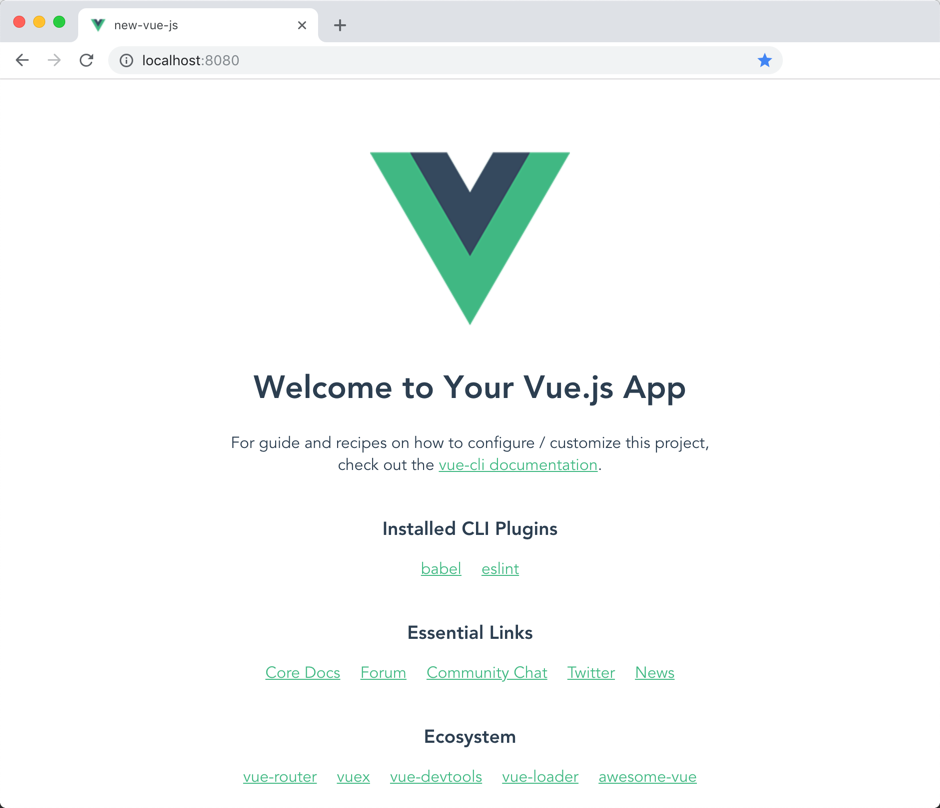

# Using CLI

You saw how easy it is to get started with Vue.js by using a CDN, but in this course we're going to focus on using the Vue CLI as there are multiple benefits of doing so, also the developement experience is much better.

When creating a new application using the Vue.js CLI, the amount of options might be a bit overwhelming, so just for now let's stick with the defaults so we can get to the other end.


At this point you should have gone through the [requirements](../before-we-start/requirements.md) and you now have the Vue.js CLI installed


Let's open now the console and type:

```bash
$ vue create my-new-app
$ cd my-new-app
$ npm run serve
```

Once we do that, our brand new app should be running on [http://localhost:8080](http://localhost:8080)



