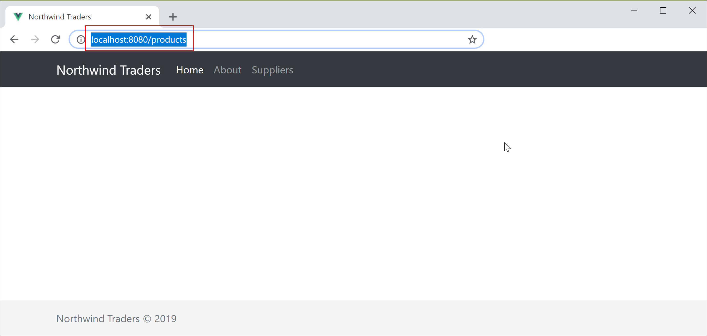
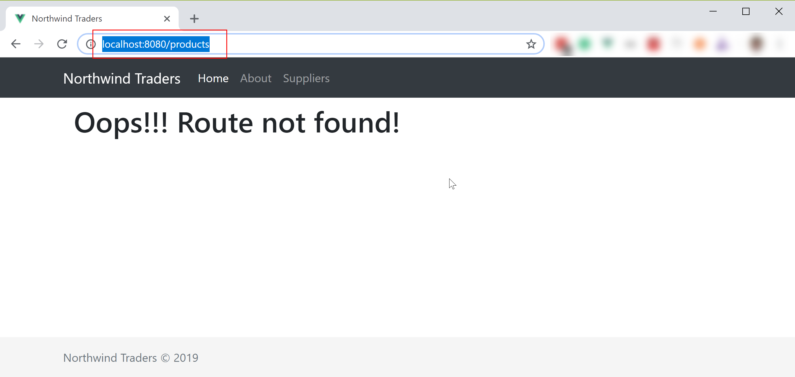

# 404: Route Not Found?

Let's try going to the **/products** route and see what happens. Obviously, the system is not going to render anything, but it also doesn't fail. 



We'll change it, so if they user tries to go somewhere the system is not prepared for, we present a generic view to show the route doesn't exist. We'll create a new **NotFound.vue** file in the **views** folder and add the content below.



```markup
<template>
  <div>
    <h1>Oops!!! Route not found!</h1>
  </div>
</template>
```



We'll update the **router.js** file to include the generic route. It's important to point here that this route needs to be the last one so it's the fall back.



```javascript
...
{
    path: '*',
    name: 'not-found',
    component: () => import('./views/NotFound.vue')
}
...
```



Now if you try to go again to **/products**, here's what we're going to see.



