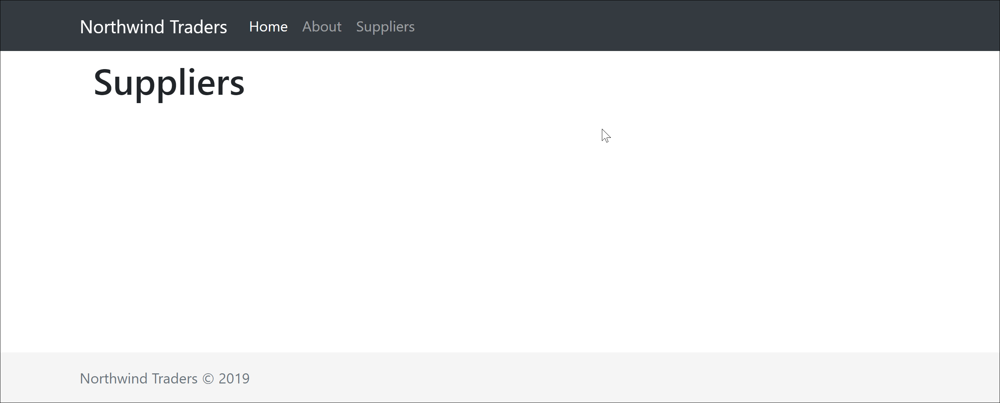
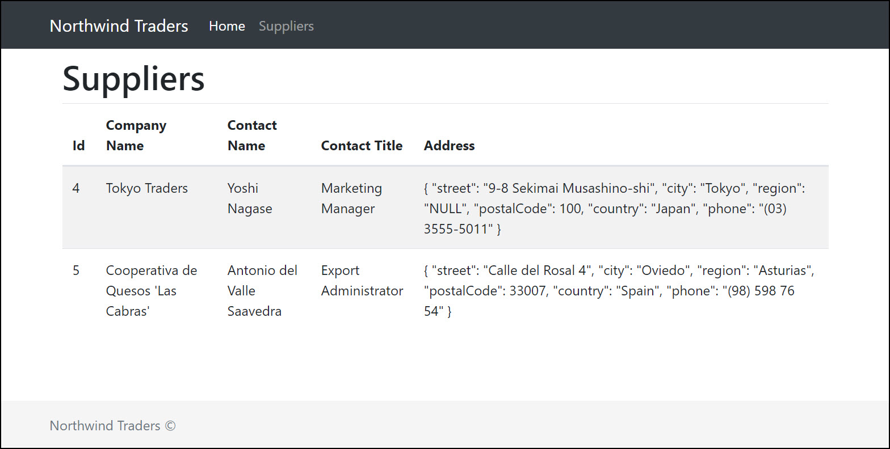
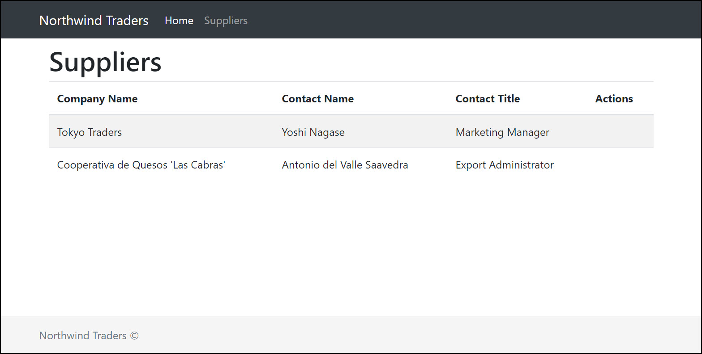
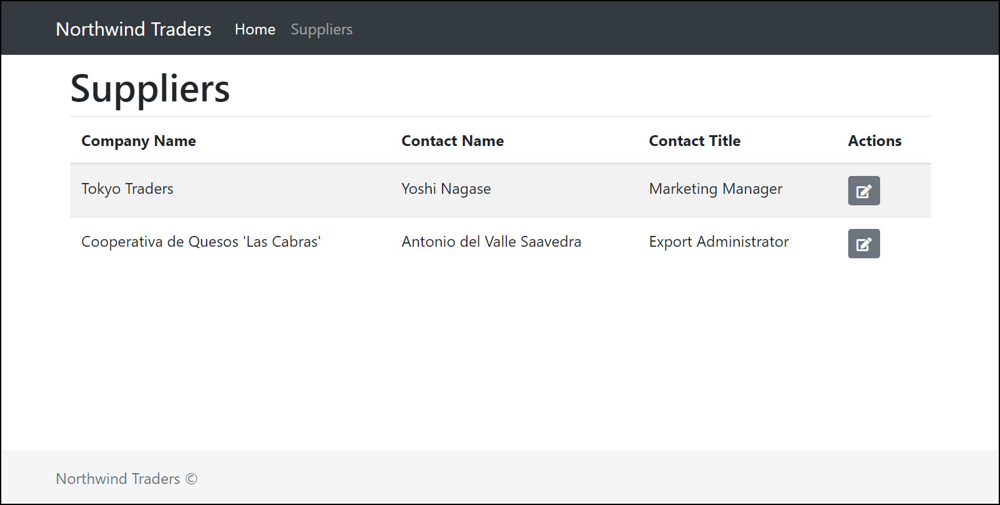

# Components: Suppliers

## Creating list component

Within **views,** create a new folder called **Suppliers**. This will contain any view related to suppliers, in our case what we're looking to build is the list and edit views. So let's start by creating a new **SupplierList.vue** file which is not going to contain much to start with, just a header.



```markup
<template>
    <div>
        <h1>Suppliers</h1>
    </div>
</template>
```



## Creating a route

We're going to update the **router.js** to include this view as a route.



```javascript
...
{
    path: '/suppliers',
    name: 'suppliers',
    component: () => import('./views/Suppliers/SupplierList.vue')
}
...
```



## Updating navigation

Next update the **NavBar.vue** component to include a new **Categories** menu item:



```markup
<li class="nav-item">
    <router-link to="/suppliers" :exact="true" class="nav-link">Suppliers</router-link>
</li>
```



Now if you navigate to **/suppliers**, that's what you're going to see the below which is not much, but a very good start.



## Displaying list of suppliers

Okay, back to the **SupplierList.vue**, we're going to make some meaningful changes so we can actually show a list of suppliers. We're going to start by creating a suppliers property in our data.



```markup
<script>
export default {
  data() {
    return {
      suppliers: [
        {
          id: 4,
          companyName: "Tokyo Traders",
          contactName: "Yoshi Nagase",
          contactTitle: "Marketing Manager",
          address: {
            street: "9-8 Sekimai Musashino-shi",
            city: "Tokyo",
            region: "NULL",
            postalCode: 100,
            country: "Japan",
            phone: "(03) 3555-5011"
          }
        },
        {
          id: 5,
          companyName: "Cooperativa de Quesos 'Las Cabras'",
          contactName: "Antonio del Valle Saavedra",
          contactTitle: "Export Administrator",
          address: {
            street: "Calle del Rosal 4",
            city: "Oviedo",
            region: "Asturias",
            postalCode: 33007,
            country: "Spain",
            phone: "(98) 598 76 54"
          }
        }
      ]
    };
  }
};
</script>
```



We're going to then update our template so we can display it. For this we're going to leverage BootstrapVue's table component as below:



```markup
...
<template>
  <div>
    <h1>Suppliers</h1>
    <b-table striped hover :items="suppliers"></b-table>
  </div>
</template>
...
```



It doesn't look amazing yet, but how awesome is it to generate a full grid with one line of code?



There are few fields that we don't necessarily want to display in the grid, so let's make some changes here. We're going to add a new fields property in the data section to list all fields we want to display in the grid. There are a lot more options to the fields you can set, like label, sorting, styling. For more information, check this [link](https://bootstrap-vue.js.org/docs/components/table).

```javascript
...
data() {
    return {
        fields: ['companyName', 'contactName', 'contactTitle', 'actions'],
        ...
    }
}
...
```

And in the template, we're going to reference this property in the table

```markup
<b-table striped hover :items="suppliers" :fields="fields"></b-table>
```

That's how it should be looking like now



You might be wondering what the actions field for since it doesn't map to any property in the supplier object. We're going to use this column to add a few action buttons. To start with, we're going to add an edit button and redirect the user to a new route.

```markup
...
<b-table striped hover :items="suppliers" :fields="fields">
  <template slot="actions" slot-scope="data">
    <router-link
      tag="button"
      :to="{ name: 'suppliers-edit', params: { id: data.item.id.toString(), supplier: data.item } }"
      class="btn btn-secondary btn-sm">
      <i class="fas fa-edit"></i>
    </router-link>
  </template>
</b-table>
...
```

With these updates, the suppliers list should be looking like this.



## Creating edit route

The main differences to the other route are first we're going to pass an **id** in the path, second we need to set **props** to true otherwise the component won't be able to read the data coming from the query string.



```javascript
{
    path: '/suppliers/:id',
    name: 'suppliers-edit',
    component: () => import('./views/Suppliers/SupplierEdit.vue'),
    props: true
}
```



## Creating edit component

You should know the drill at this point, so simply create a **SupplierEdit.vue** and let's update it. In the script section, the main thing we need to set is the **props** property to allow us receiving the data. In this case we'll be able to get both the **id** or the whole **supplier** model.



```markup
<script>
export default {
    props: {
        id: String,
        supplier: Object
    },
    data() {
        return {
            model: Object
        }
    },
    created() {
        this.model = this.supplier || {address:{}}
    }
}
</script>
```



The template at this point will be super simple, just to display the data.



```markup
<template>
  <div>
    <h1>{{id?`Supplier #${id}`:'New Supplier'}}</h1>
    <form class="form">
      <div class="form-group">
        <label class="form-label">Company Name</label>
        <input class="form-control" type="text" id="companyNameField"
          v-model="model.companyName">
      </div>
      <div class="form-group">
        <label class="form-label">Contact Name</label>
        <input class="form-control" type="text" id="contactNameField"
           v-model="model.contactName">
      </div>
      <div class="form-group">
        <label class="form-label">Contact Title</label>
        <input class="form-control" type="text"  id="contactTitleField"
          v-model="model.contactTitle">
      </div>
    </form>
    <p>
      <router-link class="btn btn-primary" to="/suppliers">Save</router-link>
      <router-link class="btn" to="/suppliers">Cancel</router-link>
    </p>
  </div>
</template>
```



## Update list to include add button

We're going to update the header of supplier list to now include an add button as below

```markup
<div class="clearfix">
  <h1 class="float-left">Suppliers</h1>
  <router-link tag="button" id="addSupplier" class="btn btn-primary float-right" 
    :to="{ name: 'suppliers-new' }">
    <i class="fas fa-plus"></i>
  </router-link>
</div>
```

You might have noticed that the new route doesn't exist yet, so let's create it in the **router.js** file. This new route needs to sit before the supplier-edit route otherwise the supplier-edit route will takeover.

```javascript
{
    path: '/suppliers/new',
    name: 'suppliers-new',
    component: () => import('./views/Suppliers/SupplierEdit.vue')
},
```

In the next section we're going to update this component so we can update a supplier, but for that we're going to introduce the concept of service and API calls.

