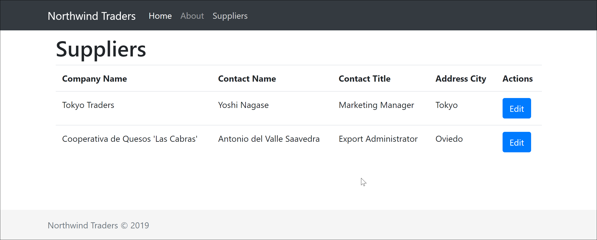

# Components: Suppliers

## Creating list component

Within **views,** create a new folder called **Suppliers**. This will contain any view related to suppliers, in our case what we're looking to build is the list and edit views. So let's start by creating a new **SupplierList.vue** file which is not going to contain much to start with, just a header.



```markup
<template>
    <div>
        <h1>Suppliers</h1>
    </div>
</template>
```



## Creating a route

We're going to update the **router.js** to include this view as a route.



```javascript
...
{
    path: '/suppliers',
    name: 'suppliers',
    component: () => import('./views/Suppliers/SupplierList.vue')
}
...
```



## Updating navigation

Next update the **NavBar.vue** component to include a new **Categories** menu item:



```markup
<li class="nav-item">
    <router-link to="/suppliers" :exact="true" class="nav-link">Suppliers</router-link>
</li>
```



Now if you navigate to **/suppliers**, that's what you're going to see the below which is not much, but a very good start.


## Displaying list of suppliers

Okay, back to the **SupplierList.vue**, we're going to make some meaningful changes so we can actually show a list of suppliers. We're going to start by creating a suppliers property in our data.



```markup
<script>
export default {
  data() {
    return {
      suppliers: [
        {
          id: 4,
          companyName: "Tokyo Traders",
          contactName: "Yoshi Nagase",
          contactTitle: "Marketing Manager",
          address: {
            street: "9-8 Sekimai Musashino-shi",
            city: "Tokyo",
            region: "NULL",
            postalCode: 100,
            country: "Japan",
            phone: "(03) 3555-5011"
          }
        },
        {
          id: 5,
          companyName: "Cooperativa de Quesos 'Las Cabras'",
          contactName: "Antonio del Valle Saavedra",
          contactTitle: "Export Administrator",
          address: {
            street: "Calle del Rosal 4",
            city: "Oviedo",
            region: "Asturias",
            postalCode: 33007,
            country: "Spain",
            phone: "(98) 598 76 54"
          }
        }
      ]
    };
  }
};
</script>
```



We're going to then update our template so we can display it. It doesn't look awesome yet because we're going to cover styling a little bit later. Also the **edit** link is not going to work right now as we haven't create the edit view yet, that's what we're doing next



```markup
<template>
  <div>
    <h1>Suppliers</h1>
    <table class="table" v-if="suppliers.length > 0">
      <tr>
        <th>Company Name</th>
        <th>Contact Name</th>
        <th>Contact Title</th>
        <th>Address City</th>
        <th>Actions</th>
      </tr>
      <tr v-for="supplier in suppliers" :key="supplier.id">
        <td>{{ supplier.companyName }}</td>
        <td>{{ supplier.contactName }}</td>
        <td>{{ supplier.contactTitle }}</td>
        <td>{{ supplier.address.city }}</td>
        <td>
          <router-link
            tag="button"
            :to="{ name: 'suppliers-edit', params: { id: supplier.id } }"
            class="btn btn-primary"
            >Edit</router-link
          >
        </td>
      </tr>
    </table>
  </div>
</template>
```





## Creating edit route

The main differences to the other route are first we're going to pass an **id** in the path, second we need to set **props** to true otherwise the component won't be able to read the data coming from the query string.



```javascript
{
    path: '/suppliers/:id',
    name: 'suppliers-edit',
    component: () => import('./views/Suppliers/SupplierEdit.vue'),
    props: true
}
```



## Creating edit component

You should know the drill at this point, so simply create a **SupplierEdit.vue** and let's update it. In the script section, the main thing we need to set is the **props** property to allow us receiving the data. In this case we'll be able to get both the **id** or the whole **supplier** model.



```markup
<script>
export default {
    props: {
        id: Number | String,
        supplier: Object
    },
    data() {
        return {
            model: Object
        }
    },
    created() {
        this.model = this.supplier || {}
    }
}
</script>
```



The template at this point will be super simple, just to display the data.



```markup
<template>
  <div>
    <h1>{{id?`Supplier #${id}`:'New Supplier'}}</h1>
    <form class="form">
      <div class="form-group">
        <label class="form-label">Company Name</label>
        <input class="form-control" type="text" v-model="model.companyName">
      </div>
      <div class="form-group">
        <label class="form-label">Contact Name</label>
        <input class="form-control" type="text" v-model="model.contactName">
      </div>
      <div class="form-group">
        <label class="form-label">Contact Title</label>
        <input class="form-control" type="text" v-model="model.contactTitle">
      </div>
    </form>
    <p>
      <router-link class="btn btn-primary" to="/suppliers">Save</router-link>
      <router-link class="btn" to="/suppliers">Cancel</router-link>
    </p>
  </div>
</template>
```



In the next section we're going to update this component so we can update a supplier, but for that we're going to introduce the concept of service and API calls.

