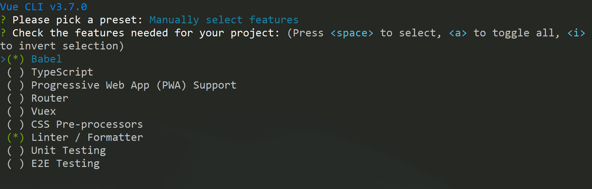

# Your First CLI App

### Using the CLI

```text
vue create northwind-traders
```




We can run the application now with the commands below:

```text
cd northwind-traders
npm run serve
```


### Using the UI

We can achieve the very same thing using the Vue UI. Let's give it a try

```text
vue ui
```


We'll follow the same steps to create a project as we did through the CLI. Let's click on **Create**


Then select a path and **Create a new project here**


Give it a name and which package manager you want to use


We're going to select some manual features and click on **Next**


We'll keep the default features for now, but it's good to know we could select more here and click **Next**


Finally, let's create the project


If you want, you can save this preset for later. Since it's just the default, we're going to **Continue without saving**


And we're done


Let's run the application now


