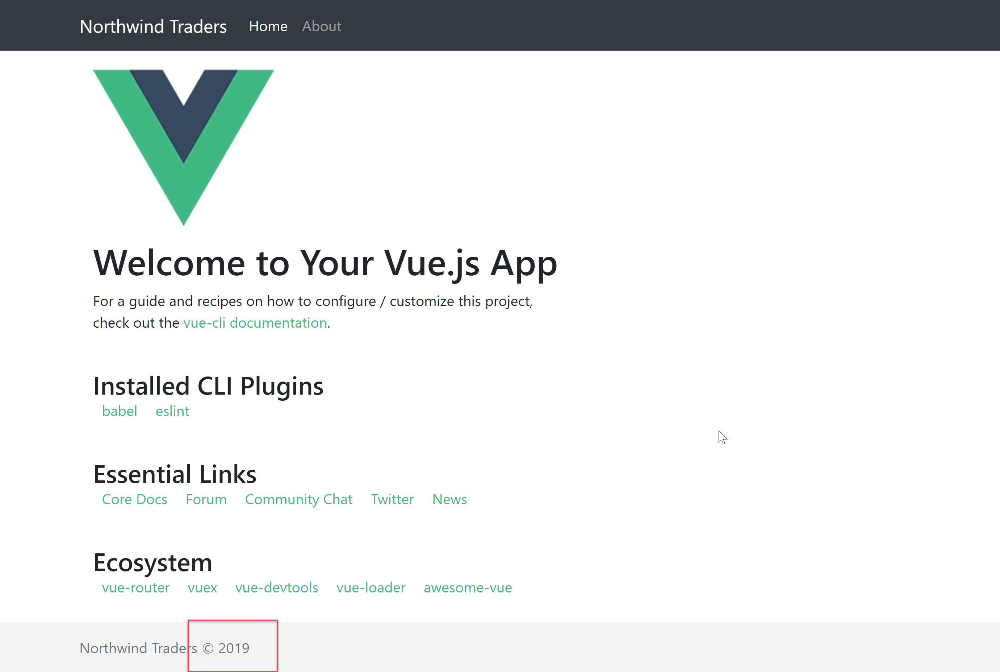

# Filters: Date

Filters are used in Vue.js to apply some common text formatting. We can apply filters using the pipe symbol in two places: interpolations and v-bind as below:

```markup
{{ model.dateOfBirth | date }}
<div v-bind:id="model.id | formatId"></div>
```

We can also send parameters to a filters like so

```text
{{ model.dateOfBirth | date('MMM-YYYY') }}
```

A filter can be defined in a component

```javascript
filters:{
    capitalize: function (value) {
        if (!value) return ''
        value = value.toString()
        return value.charAt(0).toUpperCase() + value.slice(1)
    }
}
```

Or globally

```javascript
Vue.filter('capitalize', function (value) {
  if (!value) return ''
  value = value.toString()
  return value.charAt(0).toUpperCase() + value.slice(1)
})
```

For our demo, we're going to create a date filter so we can have a nicely formatted date presented in the UI. So we're going to create a **filters** folder under **src** and create a **date.js** file in there. We're going to leverage **moment.js** for this filter and you can install it by running `npm i moment`



```javascript
import moment from 'moment'

export default function(value, format) {
    const defaultFormat = 'DD/MM/YYYY hh:mm'
    if (!format) {
        format = defaultFormat
    }
    if (value) {
        return moment(value).format(format)
    }
}
```



And to register globally, we can go to the **main.js** file and add



```javascript
import dateFilter from '@/filters/date'

Vue.filter('date', dateFilter)
```



Now in our **App.vue** we're going to use this filter to include the year of the copyright. 



```markup
<footer class="footer mt-auto py-3">
  <div class="container">
    <span class="text-muted">Northwind Traders &copy; 
      {{ new Date() | date('YYYY')}}
      </span>
  </div>
</footer>
```



After these changes are applied, we should see the current year in the footer



