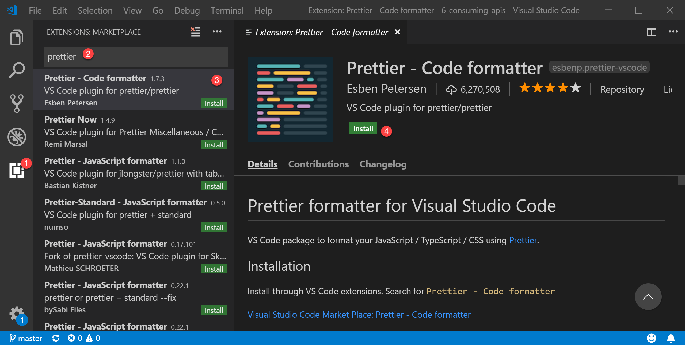

# Prettier: Code Style

Even though this topic is not mandatory, it's highly recommended so we keep the code consistent across multiple developers. This might be a discussion to have in the beginning of a project to agree on standards. 

### Installing Prettier

If you haven't do so yet, follow this to have it installed



### Configuring Prettier

In the root folder of our project, we're going to create a file called **.prettierrc.js** and we're paste this code



```javascript
module.exports = {
    singleQuote: true,
    semi: false,
    tabWidth: 4
}
```



Now if you type `CTRL+SHIFT+F` when focused on any JavaScript file, it will auto format based on the configuration above. If you want to know more about the configuration, check this [link](https://marketplace.visualstudio.com/items?itemName=esbenp.prettier-vscode).

