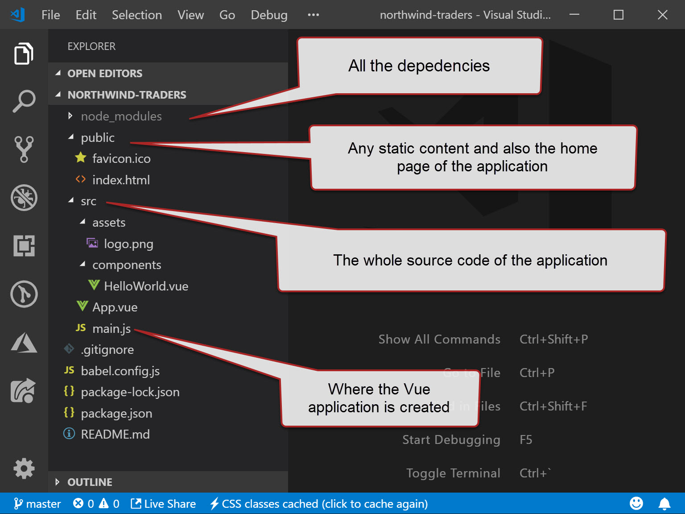
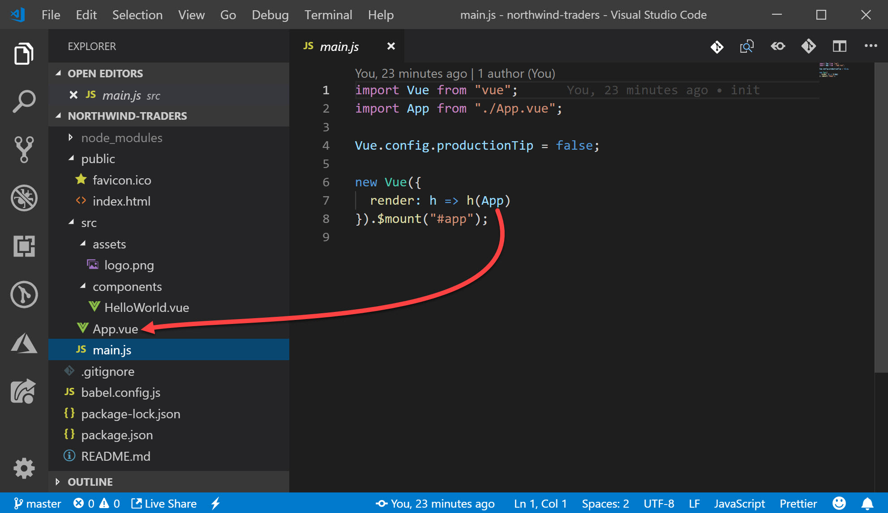
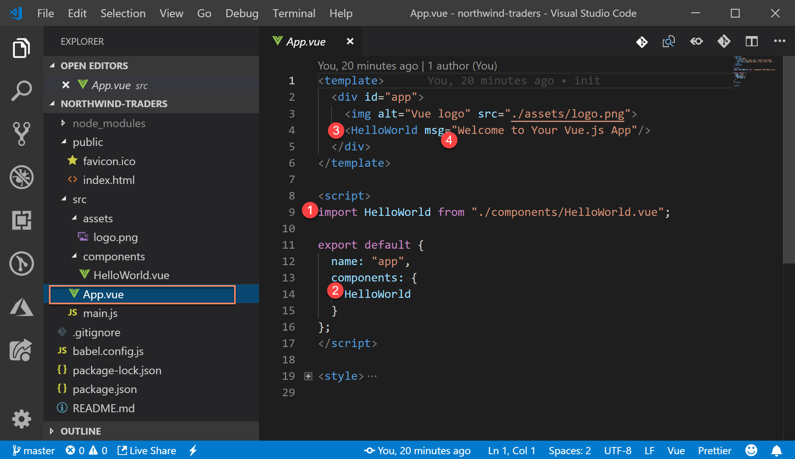
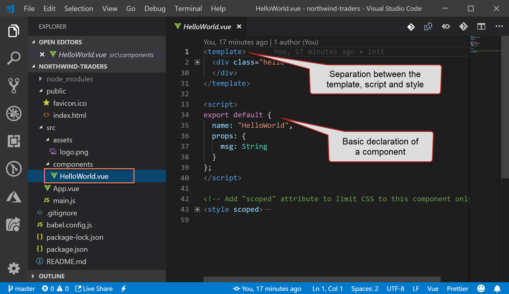

# Project Structure

Let's have a quick look at the project structure so we know our way around it, for it we'll open our application folder in VS Code.

The Vue application is create in the **main.js** and in there we see it's setting the **App** component as the main rendered of the application.

The **App** component will then be rendered and in there you can we're referencing the **HelloWorld** component, by importing it, including it in the list of components and referencing it in the template. We can also set the its **msg** parameter.

Let's take a closer look into our **HelloWorld** component and see how simple it is

