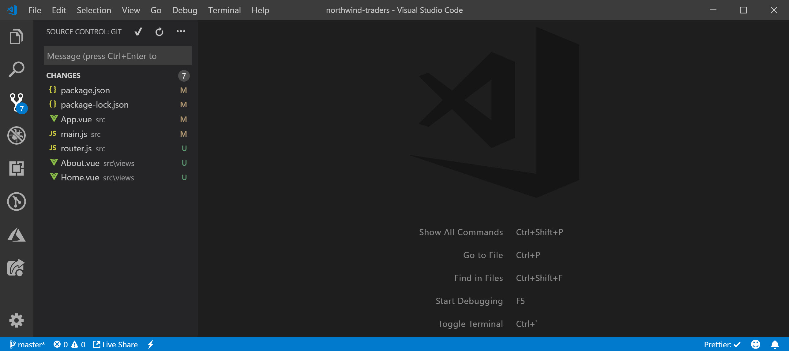

# Routing

### Installation

The easiest way to getting started with routing in an existing `vue-cli` application is by installing the router plugin. This will not only install the dependencies but also adding some sample code. To install the plugin, you can go to the `vue ui` and add it as below. An alternative is simple running in the command line `vue add router`.


Check what happened once the plugin was installed, a bunch of files where updated and some were created.



Let's see what we need to know about these changes. Two new components were created **About** and **Home**. They are going to be linked our first 2 routes which were added to **router.js**.



```javascript
import Vue from "vue";
import Router from "vue-router";
import Home from "./views/Home.vue";

Vue.use(Router);

export default new Router({
  routes: [
    {
      path: "/",
      name: "home",
      component: Home
    },
    {
      path: "/about",
      name: "about",
      // route level code-splitting
      // this generates a separate chunk (about.[hash].js) for this route
      // which is lazy-loaded when the route is visited.
      component: () =>
        import(/* webpackChunkName: "about" */ "./views/About.vue")
    }
  ]
});
```



> One thing to point out here is that the history mode is not set by the default which means that the URL will have the \# when navigating to the different routes. In order to set the history mode, just add `mode: 'history'` into the Router configuration

Now that we have the configuration for the routing, we need to hook it up with the application itself and that's what happened in the **main.js** file



```javascript
import Vue from "vue";
import App from "./App.vue";
import router from "./router";

Vue.config.productionTip = false;

new Vue({
  // the router was added here from the import above
  router,
  render: h => h(App)
}).$mount("#app");
```



There's only one thing left, where do the components will be rendered when a route is loaded? This change happened in the **App.vue** along with an example on how to navigate through routes. The `router-view` is where the components will be rendered.



```markup
<template>
  <div id="app">
    <div id="nav">
      <router-link to="/">Home</router-link> |
      <router-link to="/about">About</router-link>
    </div>
    <router-view/>
  </div>
</template>
```



For more information about routing, check the [official documentation](https://router.vuejs.org/), it's pretty comprehensive.

