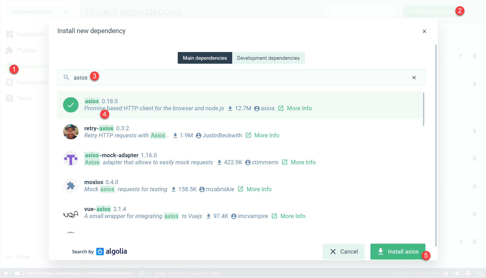
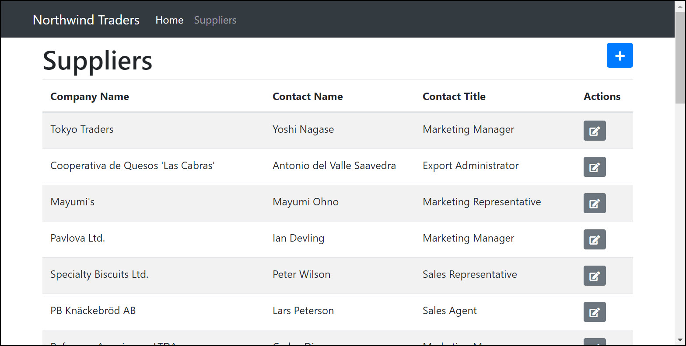

# Services

## Mock API

Before we can even start talking about services and how to talk to APIs, we need to have an API up and running. There are several places and ways for you to create and host an API, but this is definitely not the focus of this workshop and because of that we're going to use a very cool method to mock our API and a full Restful API to our disposal running locally based on a JSON file. I've recorded a video on how to use, but I'll run through the steps here anyway.



First we need to install **json-server**

```bash
npm install json-server
```

Second we're going to create a **db.json** in the root folder of our application to host our whole mock database content. You can copy the content of our highly confidential database here



We're going to update the **package.json** file to include a new script



```javascript
...
"mock-api": "json-server db.json --watch"
...
```



And to run you can

```bash
npm run mock-api
```

## Creating service

Now that we have our mock API up and running, we need to create a service to talk to it, and for this service, we're going to need to install a dependency called **axios**. You can either install it using the command line `npm i axios --save` or you use the UI for it.



Let's now create a **services** folder under **src** and create **NorthwindService.js** file. There's nothing too complicated here, we're importing **axios**, creating a new instance of it with a **baseURL** then creating a **SupplierService** with a few methods using the **apiClient** to call the endpoints we're going to use.



```javascript
import axios from 'axios'

const apiClient = axios.create({
    baseURL: `//localhost:3000`,
    withCredentials: false, // This is the default
    headers: {
        Accept: 'application/json',
        'Content-Type': 'application/json'
    }
})

export const SuppliersService = {
    getAll() {
        return apiClient.get('/suppliers')
    },
    get(id) {
        return apiClient.get('/suppliers/' + id)
    },
    update(supplier) {
        return apiClient.put('/suppliers/' + supplier.id, supplier)
    },
    create(supplier) {
        return apiClient.post('/suppliers', supplier)
    }
}
```



## Updating SupplierList.vue

Let's update the **SupplierList.vue** to get the suppliers from the API instead of going through a static list.



```markup
<script>
import { SuppliersService } from '@/services/NorthwindService.js'

export default {
    data() {
        return {
            fields: ['companyName', 'contactName', 'contactTitle', 'actions'],
            suppliers: []
        }
    },
    created() {
        SuppliersService.getAll()
            .then(r => (this.suppliers = r.data))
            .catch(err => console.error(err))
    }
}
</script>
```



The list of suppliers looks way more realistic now.



## Updating SupplierEdit.vue

We now have the SuppliersService, so let's update the **SupplierEdit.vue** file to use the update method and save any update from the user. First we're going to create a **save** button to invoke a **save** method.



```markup
<button @click="save()" class="btn btn-primary" id="saveButton">Save</button>
```



In our **SupplierEdit** component, we're going to make a few changes. We're going to add a model to data. We're going to hook up the **created** life-cycle hook to get the full details from the API and finally create a **save** method to update the supplier and navigate back to the supplier list.



```markup
<script>
import { SuppliersService } from '@/services/NorthwindService.js'
export default {
    props: {
        id: String,
        supplier: Object
    },
    data() {
        return {
            model: Object
        }
    },
    created() {
        this.model = this.supplier || {}
        if (this.id && !this.supplier) {
            SuppliersService.get(this.id).then(r => (this.model = r.data))
        }
    },
    methods: {
        save() {
            if (this.id) {
                SuppliersService.update(this.model)
                    .then(r => this.navigateBack())
                    .catch(err => console.error(err))
            } else {
                SuppliersService.create(this.model)
                    .then(r => this.navigateBack())
                    .catch(err => console.error(err))
            }
        },
        navigateBack() {
            this.$router.push('/suppliers')
        }
    }
}
</script>
```



