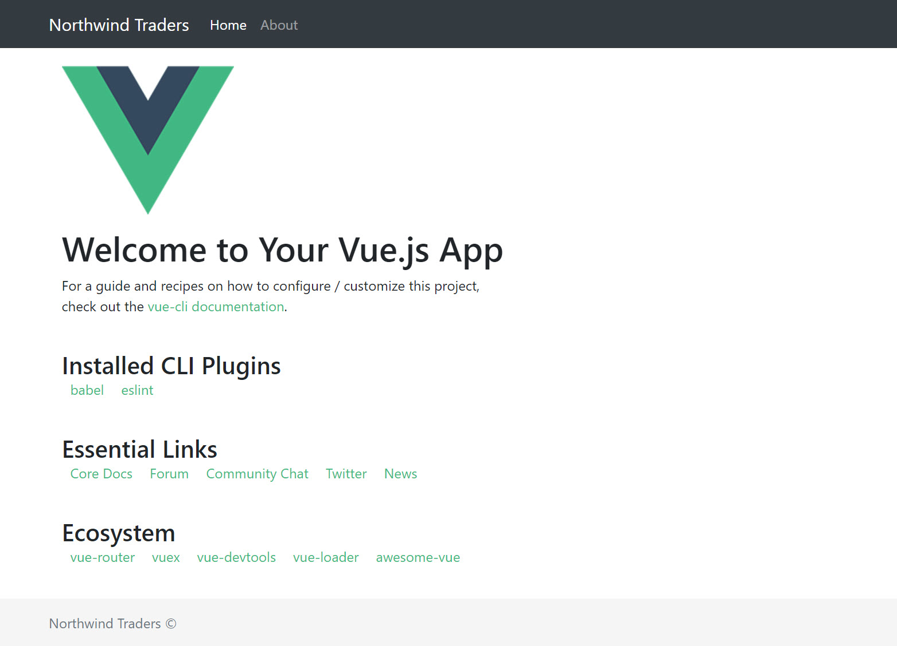

# Site Components

## Update the site layout

Set the site's title to _Northwind Traders_. Within the **public** folder, open **index.html** and update the site title:



```markup
...
<title>Northwind Traders</title>
...
```



We're going to use the Bootstrap UI framework and to do so, we need first to install some dependencies with the command `npm i vue bootstrap-vue bootstrap` , next we'll update the **main.js** file to include these lines just after the last import

```javascript
import BootstrapVue from 'bootstrap-vue'

import 'bootstrap/dist/css/bootstrap.css'
import 'bootstrap-vue/dist/bootstrap-vue.css'

Vue.use(BootstrapVue)
```

## Adding a site navbar

Every site needs a navbar. Within the **components** folder, create a new file **NavBar.vue** and update as follows:



```markup
<template>
  <nav class="navbar navbar-expand-lg navbar-dark bg-dark">
    <div class="container">
      <a class="navbar-brand" href="#">Northwind Traders</a>
      <button
        class="navbar-toggler"
        type="button"
        data-toggle="collapse"
        data-target="#navbarCollapse">
        <span class="navbar-toggler-icon"></span>
      </button>

      <div class="collapse navbar-collapse" id="navbarCollapse">
        <ul class="navbar-nav mr-auto">
          <li class="nav-item active">
            <router-link to="/" :exact="true" class="nav-link">Home</router-link>
          </li>
          <li class="nav-item">              
            <router-link to="/about" :exact="true" class="nav-link">About</router-link>
          </li>
        </ul>
      </div>
    </div>
  </nav>
</template>

<script>
export default {};
</script>

<style scoped>
.nav > .container {
  min-height: 56px;
}
</style>
```



Next, update **App.vue** to support the new navbar component:



```markup
<template>
  <div id="app">
    <header>
      <nav-bar></nav-bar>
    </header>

    <div class="container">
      <div class="row">
        <div class="col">
          <main role="main" class="flex-shrink-0">
            <div class="container">
              <router-view/>
            </div>
          </main>
        </div>
      </div>
    </div>
    <footer class="footer mt-auto py-3">
      <div class="container">
        <span class="text-muted">Northwind Traders &copy;</span>
      </div>
    </footer>
  </div>
</template>

<script>
import NavBar from "./components/NavBar.vue";

export default {
  name: "app",
  components: {
    NavBar
  }
};
</script>

<style>
html,
body {
  height: 100%;
}

#app {
  display: flex;
  flex-direction: column;
  height: 100%;
}

main > .container {
  padding: 8px 15px 8px 15px;
}

.footer {
  background-color: #f5f5f5;
}

.footer > .container {
  padding-right: 15px;
  padding-left: 15px;
}
</style>
```



Be sure to replace the existing styles with the new styles from the above code.

Save all changes and verify that the site appears correctly:



