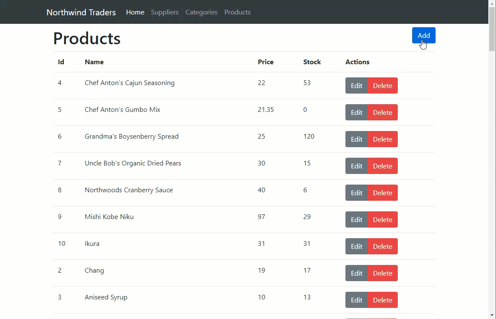
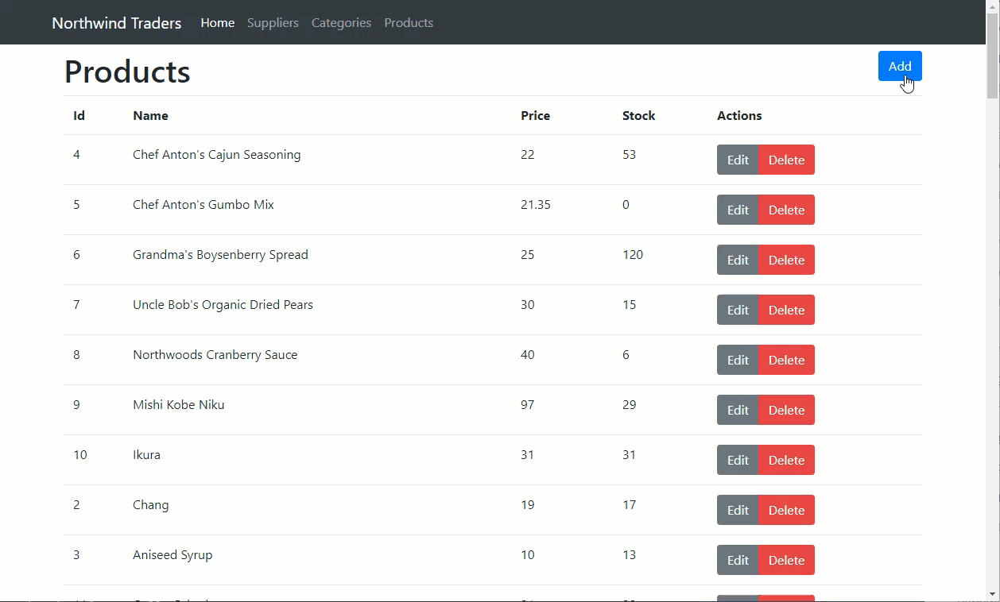

# Advanced Validation

### Install and Configure Vuelidate

[Vuelidate](https://monterail.github.io/vuelidate) provides simple, lightweight model-based validation for Vue.js. The package is installed using npm:

```text
npm install vuelidate --save
```

Import the library and enable globally for all components containing validation configuration:



```javascript
...
import Vuelidate from 'vuelidate'

Vue.use(Vuelidate)
...
```



With that in place, you are ready to start using Vuelidate.

### Basic validation checks

Update **ProductEdit.vue** to include validation checks for product name. Product name is required and has a minimum length of 4 characters and a maximum length of 40 characters. First import the required built-in validators:



```javascript
...
import { required, minLength, maxLength } from 'vuelidate/lib/validators'
...
```



Then, add the new validation checks:



```javascript
...
validations: {
    product: {
        name: {
            required,
            minLength: minLength(4),
            maxLength: maxLength(40)
        }
    }
},
...
```



Finally, update the template to display any validation error messages:



```markup
...
<div class="form-group">
    <label>Name</label>
    <input type="text" class="form-control"
        v-model.trim="$v.product.name.$model"
        :class="{ 'is-invalid': $v.product.name.$error }">
    <div class="invalid-feedback" v-if="!$v.product.name.required">
        Name is a required field.
    </div>
    <div class="invalid-feedback" v-if="!$v.product.name.minLength">
        Name must be at least 4 characters.
    </div>
    <div class="invalid-feedback" v-if="!$v.product.name.maxLength">
        Name can be at most 40 characters.
    </div>
</div>
...
```



Now add validation checks to ensure that unit price, units in stock, units on order, and reorder level are of the correct type and not less than zero. First, import the required built-in validators \(decimal, numeric, minValue\):



```javascript
...
import {
    required,
    minLength,
    maxLength,
    decimal,
    numeric,
    minValue
} from 'vuelidate/lib/validators'
...
```



Then, add the necessary validations:



```javascript
...
validations: {
    product: {
    
        ...
        
        unitPrice: {
            decimal,
            minValue: minValue(0)
        },
        unitsInStock: {
            numeric,
            minValue: minValue(0)
        },
        unitsOnOrder: {
            numeric,
            minValue: minValue(0)
        },
        reorderLevel: {
            numeric,
            minValue: minValue(0)
        }
        ...
    }
},
...
```



Update the relevant form groups as follows:



```markup
...
<div class="form-group col-md-4">
    <label>Unit Price</label>
    <input type="number" class="form-control" 
        v-model="$v.product.unitPrice.$model"
        :class="{ 'is-invalid': $v.product.unitPrice.$error }">
    <div class="invalid-feedback" v-if="!$v.product.unitPrice.decimal">
        Unit price is of type decimal.
    </div>
    <div class="invalid-feedback" v-if="!$v.product.unitPrice.minValue">
        Unit price must be greater than zero.
    </div>
</div>
<div class="form-group col-md-4">
    <label>Units In Stock</label>
    <input type="number" class="form-control" 
        v-model="$v.product.unitsInStock.$model"
        :class="{ 'is-invalid': $v.product.unitsInStock.$error }">
    <div class="invalid-feedback" v-if="!$v.product.unitsInStock.numeric">
        Units in stock is of type integer.
    </div>
    <div class="invalid-feedback" v-if="!$v.product.unitsInStock.minValue">
        Units in stock can not be less than zero.
    </div>
</div>
<div class="form-group col-md-4">
    <label>Units On Order</label>
    <input type="number" class="form-control" 
        v-model="$v.product.unitsOnOrder.$model"
        :class="{ 'is-invalid': $v.product.unitsOnOrder.$error }">
    <div class="invalid-feedback" v-if="!$v.product.unitsOnOrder.numeric">
        Units on order is of type integer.
    </div>
    <div class="invalid-feedback" v-if="!$v.product.unitsOnOrder.minValue">
        Units on order can not be less than zero.
    </div>
</div>

...

<div class="form-group col-md-4">
    <label>Reorder Level</label>
    <input type="number" class="form-control" 
        v-model="$v.product.reorderLevel.$model"
        :class="{ 'is-invalid': $v.product.reorderLevel.$error }">
    <div class="invalid-feedback" v-if="!$v.product.reorderLevel.numeric">
        Reorder level is of type integer.
    </div>
    <div class="invalid-feedback" v-if="!$v.product.reorderLevel.minValue">
        Reorder level can not be less than zero.
    </div>
</div>
...
```



Enforce validation rules when the form is submitted by updating the `save` method as follows:



```javascript
...
save() {
  this.$v.$touch()

  if (this.$v.$invalid) return
...
```



Save all changes and verify that the validation behaves as expected:



### Conditional validation checks

In this section you will add an conditional validation check. **Units On Order** must be greater than zero when **Units In Stock** is zero and **Status** is not discontinued.

Just after the import states, add the following function:



```javascript
...
const reorderNotRequired = (value, vm) =>
    vm.discontinued || vm.unitsInStock > 0 || vm.unitsOnOrder > 0
...
```



Update the validations for `unitsOnOrder` as follows:



```javascript
...
unitsOnOrder: {
    integer,
    minValue: minValue(0),
    reorderNotRequired
},
...
```



Finally, add a new invalid feedback element to the units on order form group:



```markup
...
<div class="invalid-feedback" v-if="!$v.product.unitsOnOrder.reorderNotRequired">
    Stock has run out! Units on order must be greater than zero.
</div>
...
```



Save all changes and verify that the new validation check works as expected.

### Asynchronous validation checks

In this final section you will add an asynchronous validation check to ensure that a product name is unique. The implementation will call the backend API to perform the check. Start by adding a new method to the `ProductsService`:



```javascript
...
isUniqueProductName(name) {
    return apiClient.get('/products?name=' + name).then(result => {
        return result.data.length === 0
    })
}
...
```



Next, update the validation for product name:



```javascript
...
name: {
    required,
    minLength: minLength(4),
    maxLength: maxLength(40),
    isUnique(value) {
        if (value === '') return true

        return ProductsService.isUniqueProductName(value)
    }
},
...
```



Finally, update the form group for product name. Note the addition of the lazy modifier on the v-model binding.



```markup
...
<input type="text" class="form-control"
    v-model.trim.lazy="$v.product.name.$model"
    :class="{ 'is-invalid': $v.product.name.$error }">

...

<div class="invalid-feedback" v-if="!$v.product.name.isUnique">
    This product name already exists.
</div>
...
```



Save all changes and verify that the validation behaves as expected:



