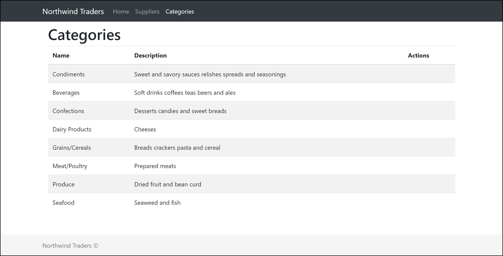
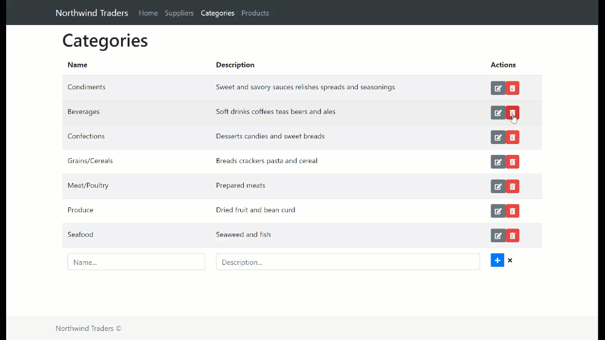

# Inline Forms

## 

## Creating the list component

Start by creating a component to display a list of categories. Within the **views** folder, create a new folder named **Categories**. Then, within the new folder, create a new component named **CategoryList.vue** as follows:



```markup
<template>
    <div>
        <h1>Categories</h1>
    </div>
</template>

<script>
export default {}
</script>

<style scoped>
</style>
```



## Updating the site navigation bar

Next update the **NavBar.vue** component to include a new **Categories** menu item:



```markup
...
<li class="nav-item">
    <router-link to="/categories" :exact="true" class="nav-link">
        Categories
    </router-link>
</li>
...
```



You might have noticed that the route does not exist, add the missing route within **router.js**:



```javascript
...
{
    path: '/categories',
    name: 'categories',
    component: () => import('./views/Categories/CategoryList.vue')
},
...
```



Save all changes and refresh the site. Ensure that you can navigate to the new categories page.

## Create the Categories service

In order to support creating, updating and deleting categories, add a new `CategoriesService`within the **NorthwindService.js** file:



```javascript
...
export const CategoriesService = {
    getAll() {
        return apiClient.get('/categories')
    },
    get(id) {
        return apiClient.get('/categories/' + id)
    },
    create(category) {
        return apiClient.post('/categories/', category)
    },
    update(category) {
        return apiClient.put('/categories/' + category.id, category)
    },
    delete(id) {
        return apiClient.delete('/categories/' + id)
    }
}
...
```



Like the previously created `SuppliersService`, this service simply utilises [Axios](https://github.com/axios/axios) to make HTTP requests against the backend API.

## Displaying the list of categories

The next step is to update the `CategoryList` component to display the list of categories. Start by retrieving the categories using the newly created `CategoryService`. Within the script block, add the following code:



```javascript
...
import { CategoriesService } from '@/services/NorthwindService.js'

export default {
    data() {
        return {
            fields: ['name', 'description', 'actions'],
            categories: []
        }
    },
    created() {
        this.fetchAll()
    },
    methods: {
        fetchAll() {
            CategoriesService.getAll()
                .then(result => (this.categories = result.data))
                .catch(error => console.error(error))
        }
    }
}
...
```



Then update the template as follows:



```markup
...
<template>
    <div>
        <h1>Categories</h1>
        <b-table striped hover :items="categories" :fields="fields"></b-table>
    </div>
</template>
...
```



Save all changes and refresh the site. Ensure that you can view a list of categories:



## Add support for inline editing and deleting

Adding support for inline editing is straight-forward. For each table row you will add support for two states; display and edit. In the display state, the row will appear as read-only with the edit and delete actions visible. In the edit state, the row will appear as editable with the update and cancel actions visible.

Start by modifying the table to support the two states as follows:



```markup
...
<b-table striped hover :items="categories" :fields="fields">
  <template slot="actions" slot-scope="data">
    <div v-if="editingCategory.id!=data.item.id">
      <button class="btn btn-secondary btn-sm" @click="edit(data.item, data.index)">
        <i class="fas fa-edit"></i></button>
      <button class="btn btn-danger btn-sm" @click="remove(data.item, data.item.id)">
        <i class="fas fa-trash-alt"></i></button>
    </div>
    <div v-else>
      <button class="btn btn-primary btn-sm" @click="update()">
        <i class="fas fa-save"></i></button>
      <button class="btn btn-default btn-sm" @click="cancelUpdate()">
        <i class="fas fa-times"></i></button>
    </div>
  </template>
  <template slot="name" slot-scope="data">
    <template v-if="editingCategory.id!=data.item.id">{{data.value}}</template>
    <template v-else>
      <input type="text" class="form-control" v-model="editingCategory.name">
    </template>
  </template>
  <template slot="description" slot-scope="data">
    <template v-if="editingCategory.id!=data.item.id">{{data.value}}</template>
    <template v-else>
      <input type="text" class="form-control" v-model="editingCategory.description">
    </template>
  </template>
</b-table>
...
```



The first table row supports the edit state and the second supports the display state. Next you need to update the component's `data`and `methods` to support the above template. Add the following properties to support editing and undoing editing changes:



```javascript
...
editingCategory: {},
editingIndex: null,
...
```



Next, add the following methods:



```javascript
...
edit(category, index) {
    this.editingCategory = { ...category }
    this.editingIndex = index
},
update() {
    CategoriesService.update(this.editingCategory)
        .then(() => {
            this.editingCategory = {}
            this.fetchAll()
        })
        .catch(error => console.error(error))
},
cancelUpdate() {
    this.editingCategory = {}
}
...
```



Now add support for deleting categories. First add the following method:



```javascript
...
remove(cat, id) {
    CategoriesService.delete(id)
        .then(() => this.fetchAll())
        .catch(error => console.error(error))
}
...
```



Save changes and verify that you can now edit, update, and delete categories. In addition, check that you can cancel changes to a category that you are editing.

## Include support for inline adding

This component would not be complete without the ability to add new categories. Start by updating the template, add the following table row just before the `b-table`'s closing tag:



```markup
...
<template slot="bottom-row">
  <td>
    <input type="text" v-model="addingCategory.name" placeholder="Name..." class="form-control">
  </td>
  <td>
    <input type="text" v-model="addingCategory.description" placeholder="Description..." class="form-control">
  </td>
  <td>
    <div class="btn-group" role="group">
      <button type="button" class="btn btn-primary btn-sm" @click="add()">
        <i class="fas fa-plus"></i>
      </button>
      <button type="button" class="btn btn-default btn-sm" @click="resetAdd()">
        <i class="fas fa-times"></i>
      </button>
    </div>
  </td>
</template>
...
```



The above row supports adding and undoing changes similar to the edit category feature. Now update the component's `data`and `methods` to support the above template. Starting with `data`:



```javascript
addingCategory: {
    name: '',
    description: ''
},
defaultCategory: {
    name: '',
    description: ''
}
```



Next, add the following methods:



```javascript
add() {
    CategoriesService.create(this.addingCategory)
        .then(result => {
            this.categories.push(result.data)
            this.resetAdd()
        })
        .catch(error => console.error(error))
},
resetAdd() {
    this.addingCategory = { ...this.defaultCategory }
}
```



All done, you should now be able to add new categories. Take a moment to verify all functionality before moving to the next section.


## Deletion confirmation

Everything is working really nicely but one thing is not quite right. The user can accidentally click on the delete button and the item will be gone. It's good practice to prompt the user to confirm either he/she really wants to delete an item. 

We're going to update the remove method to prompt the user to confirm the deletion and for that we're going to use the **b-modal**, if you want to check some other options for this component, check this [link](https://bootstrap-vue.js.org/docs/components/modal/). 

```javascript
...
remove(cat, id) {
    this.$bvModal
        .msgBoxConfirm(
            `Please confirm that you want to delete '${cat.name}'.`,
            {
                title: 'Please Confirm',
                size: 'sm',
                buttonSize: 'sm',
                okVariant: 'danger',
                okTitle: 'Delete',
                cancelVariant: 'default',
                cancelTitle: 'Cancel',
                footerClass: 'p-2',
                hideHeaderClose: false,
                centered: true
            }
        )
        .then(value => {
            if (value) {
                CategoriesService
                  .delete(id)
                  .then(r =>(this.categories = this.categories.filter(d => d.id != id)))
            }
        })
}
...
```

When the user now tries to delete an item, that's what he/she is going to see



