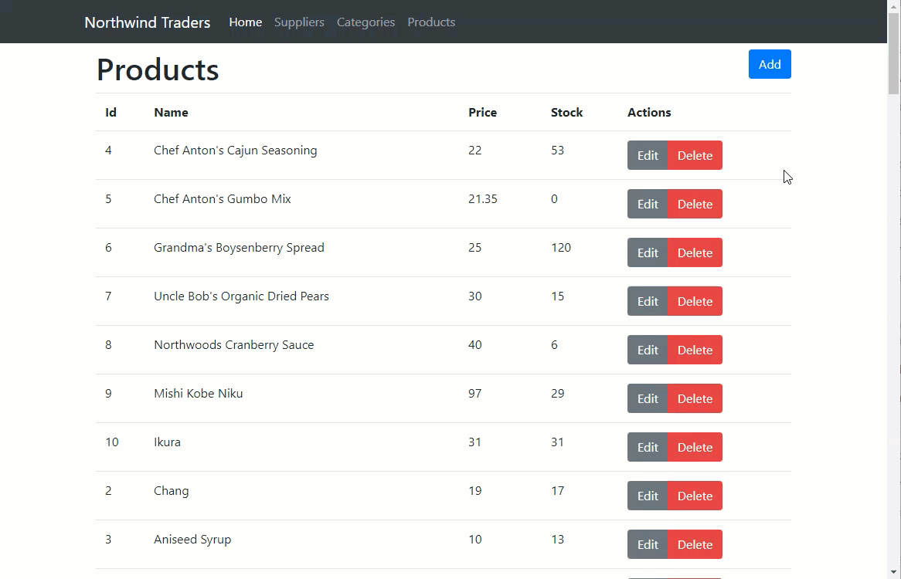

# Complex Forms

## Create the Products service

In order to support creating, updating and deleting products, add a new `ProductsService`within the **NorthwindService.js** file:



```javascript
...
export const ProductsService = {
    getAll() {
        return apiClient.get('/products')
    },
    get(id) {
        return apiClient.get('/products/' + id)
    },
    create(product) {
        return apiClient.post('/products/', product)
    },
    update(product) {
        return apiClient.put('/products/' + product.id, product)
    },
    delete(id) {
        return apiClient.delete('/products/' + id)
    }
}
...
```



Like the previously created `CategoriesService`, this service simply utilises [Axios](https://github.com/axios/axios) to make HTTP requests against the backend API.

## Creating new components

Start by creating a component to display a list of categories. Within the **views** folder, create a folder named **Products**. Within the new folder, create a file named **ProductList.vue** and implement as follows:



```markup
<template>
    <div>
        <h1>Products</h1>
    </div>
</template>

<script>
export default {}
</script>

<style scoped>
</style>
```



Next, create a component to support adding and editing components. Within the **Products** folder, create a new file named **ProductEdit.vue** and implement as follows:



```markup
<template>
    <div>
        <h1>{{ this.id === 0 ? 'Add' : 'Edit' }} Product</h1>
    </div>
</template>

<script>
export default {
    props: {
        id: {
            type: Number,
            required: true
        }
    }
}
</script>

<style scoped>
</style>
```



## Update the site navigation

Add a Products menu item to the site navigation bar. Open **NavBar.vue** and update as follows:



```markup
...
<li class="nav-item">
    <router-link to="/products" :exact="true" class="nav-link">
        Products
    </router-link>
</li>
...
```



Next add routes to support the new components within **router.js**:



```javascript
...
{
    path: '/products',
    name: 'products',
    component: () => import('./views/Products/ProductList.vue')
},
{
    path: '/products/:id',
    name: 'products-edit',
    component: () => import('./views/Products/ProductEdit.vue'),
    props: true
},
...
```



Save all changes and ensure that you can now navigate to the new products page.

## Displaying the list of products

The next step is to update the `ProductList` component to display the list of products. Start by retrieving the products using the newly created `ProductService`. Within the script block, add the following code:



```javascript
...
import { ProductsService } from '@/services/NorthwindService.js'

export default {
    data() {
        return {
            products: []
        }
    },
    created() {
        this.fetchAll()
    },
    methods: {
        fetchAll() {
            ProductsService.getAll()
                .then(result => (this.products= result.data))
                .catch(error => console.error(error))
        }
    }
}
...
```



Then update the template as follows:



```markup
...
<template>
    <div>
        <div class="clearfix">
            <h1 class="float-left">Products</h1>
            <router-link tag="button" class="btn btn-primary float-right"
                :to="{ name: 'products-edit', params: { id: 0 } }">Add</router-link>
        </div>
        <table class="table">
            <tr>
                <th>Id</th>
                <th>Name</th>
                <th>Price</th>
                <th>Stock</th>
                <th>Actions</th>
            </tr>
            <tr v-for="product in products" :key="product.id">
                <td>{{ product.id }}</td>
                <td>{{ product.name }}</td>
                <td>{{ product.unitPrice }}</td>
                <td>{{ product.unitsInStock }}</td>
                <td>
                    <div class="btn-group" role="group">
                        <router-link tag="button" 
                            :to="{name:'products-edit',params:{id:product.id}}" class="btn btn-secondary">Edit</router-link>
                        <button type="button" class="btn btn-danger">Delete</button>
                    </div>
                </td>
            </tr>
        </table>
    </div>
</template>
...
```



Save all changes and refresh the site. Ensure that you can view a list of categories and that the Add and Edit buttons are wired up correctly:



## Adding and editing products

Support for adding and editing products will be implemented within the `ProductEdit` component. When navigating to the component, an `id` property will be included in the query string. If `id` is zero, then the form will be in add mode. If not, the form will be in edit mode.

This component will require a list of categories and suppliers, and access to a specific product \(if editing\). Start by updating **ProductEdit.vue** to import the required services:



```javascript
...
import {
    CategoriesService,
    SuppliersService,
    ProductsService
} from '@/services/NorthwindService.js'
...
```



Next, initialise all required data with default values. Note that `product` is initialised for adding a new product. If in edit mode, this will be replaced by fetching a specific product.



```markup
...
data() {
    return {
        categories: [],
        suppliers: [],
        product: {
            id: 0,
            supplierID: null,
            categoryID: null,
            quantityPerUnit: '',
            unitPrice: 0.0,
            unitsInStock: 0,
            unitsOnOrder: 0,
            reorderLevel: 0,
            discontinued: false,
            name: ''
        }
    }
},
...
```



Next fetch all categories, suppliers, and a specific product \(if in edit mode\). Using the `created` life cycle event to implement as follows:



```javascript
...
created() {
    CategoriesService.getAll().then(
        result => (this.categories = result.data)
    )

    SuppliersService.getAll().then(
        result => (this.suppliers = result.data)
    )

    if (this.id !== 0) {
        ProductsService.get(this.id).then(
            result => (this.product = result.data)
        )
    }
},
...
```



Now add methods to support saving changes \(either creating or updating\) and navigating back to the list of products:



```javascript
...
methods: {
    save() {
        if (this.id === 0) {
            ProductsService.create(this.product)
                .then(() => this.navigateBack())
                .catch(error => { console.error(error) })
        } else {
            ProductsService.update(this.product)
                .then(() => this.navigateBack())
                .catch(error => { console.error(error) })
        }
    },
    navigateBack() {
        this.$router.push('/products')
    }
},
...
```



Finally, add the template to add or edit a product:



```markup
...
<template>
    <div>
        <h1>{{ this.id === 0 ? 'Add' : 'Edit' }} Product</h1>

        <form @submit.prevent="save()">
            <div class="form-group">
                <label>Name</label>
                <input type="text" class="form-control" v-model="product.name">
            </div>
            <div class="form-group">
                <label>Category</label>
                <select class="form-control" v-model.number="product.categoryID">
                    <option
                        v-for="category in categories"
                        :key="category.id"
                        :value="category.id"
                    >{{ category.name }}</option>
                </select>
            </div>
            <div class="form-group">
                <label>Supplier</label>
                <select class="form-control" v-model.number="product.supplierID">
                    <option
                        v-for="supplier in suppliers"
                        :key="supplier.id"
                        :value="supplier.id"
                    >{{ supplier.companyName }}</option>
                </select>
            </div>
            <div class="form-group">
                <label>Quantity Per Unit</label>
                <input type="text" class="form-control" v-model="product.quantityPerUnit">
            </div>
            <div class="form-row">
                <div class="form-group col-md-4">
                    <label>Unit Price</label>
                    <input type="number" class="form-control" v-model="product.unitPrice">
                </div>
                <div class="form-group col-md-4">
                    <label>Units In Stock</label>
                    <input type="number" class="form-control" v-model="product.unitsInStock">
                </div>
                <div class="form-group col-md-4">
                    <label>Units On Order</label>
                    <input type="number" class="form-control" v-model="product.unitsOnOrder">
                </div>
            </div>
            <div class="form-row">
                <div class="form-group col-md-4">
                    <label>Reorder Level</label>
                    <input type="number" class="form-control" v-model="product.reorderLevel">
                </div>
                <div class="form-group col-md-4">
                    <label>Status</label>
                    <div class="form-check">
                        <input
                            class="form-check-input"
                            type="checkbox"
                            id="discontinuedCheckbox"
                            v-model="product.discontinued"
                        >
                        <label class="form-check-label" for="discontinuedCheckbox">Discontinued</label>
                    </div>
                </div>
            </div>

            <button type="submit" class="btn btn-primary">Save</button>
            <button @click="navigateBack()" class="btn btn-default">Cancel</button>
        </form>
    </div>
</template>
...
```



That completes adding and editing products. Ensure that this feature is behaving as expected:


## Deleting products

The delete button is not working. You can fix that now. Update **ProductList.vue** as follows.  
First add a click event on the delete button:



```markup
...
<button type="button" class="btn btn-danger" @click="remove(product.id)">Delete</button>
...
```



Then add a method to actually delete the product:



```javascript
...
remove(id) {
    ProductsService.delete(id)
        .then(() => (this.products = this.products.filter(p => p.id !== id)))
        .catch(error => console.error(error))
}
...
```



Before moving on to the next section, take a moment to ensure that delete behaves as expected.

