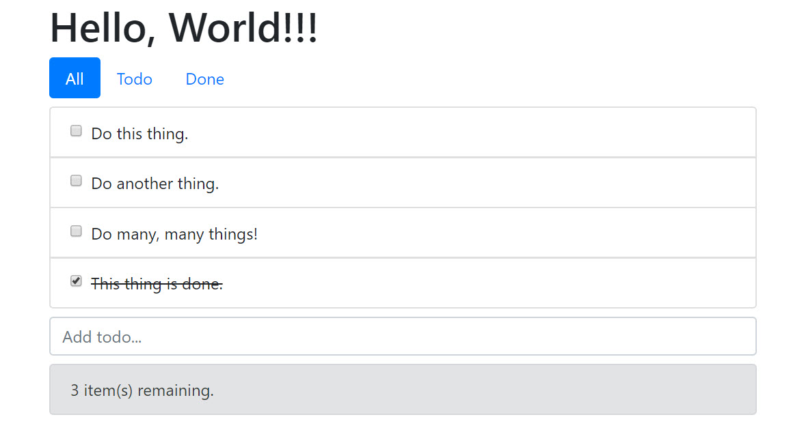

# Components

### Remaining items component

In the top of the **main.js** file we're going to create a brand new component. Notice that the template property contains almost a copy of the remaining items area in the root template.



```javascript
Vue.component("remaining-items", {
  props: ["remaining"],
  template: `
    <div class="alert alert-danger" v-if="remaining>10">
      You've got a long day ahead of you!!!
    </div>
    <div class="alert alert-secondary" v-else-if="remaining>0">
      {{ remaining }} item(s) remaining.
    </div>
    <div class="alert alert-success" v-else>
      Hooray!!! You're all done, go to the beach!!!
    </div>`
});
...
```



Now update the **index.html** and replace the 3 `div` elements responsible for showing the remaining items message by the below



```javascript
...
<remaining-items :remaining="todos.filter(t => !t.done).length"></remaining-items>
...
```



Save your changes and ensure the app is behaving normally:



### Add item component

This component will encapsulate the add item functionality. 



```javascript
...
Vue.component("add-item", {
  template: `
        <form class="mb-2" v-on:submit.prevent="add">
            <input
            class="form-control"
            placeholder="Add todo..."
            v-model="newTodo" />
        </form>
          `,
  data() {
    return {
      newTodo: undefined
    };
  },
  methods: {
    add() {
      this.$emit("submitted", this.newTodo);
      this.newTodo = undefined;
    }
  }
});
...
```



We'll now replace the form in the root template using the component



```markup
...
<add-item @submitted="addTodo($event)"></add-item>
...
```



We're also going to update the `addTodo` method in the root component to handle the data coming from the child component



```javascript
...
addTodo(todo) {
  this.todos.push({
    id: this.nextId++,
    title: todo,
    created: new Date(),
    done: false
  });
}
...
```



Save your changes and ensure that you can add new items.

