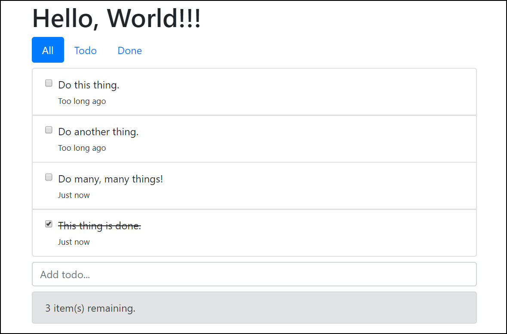
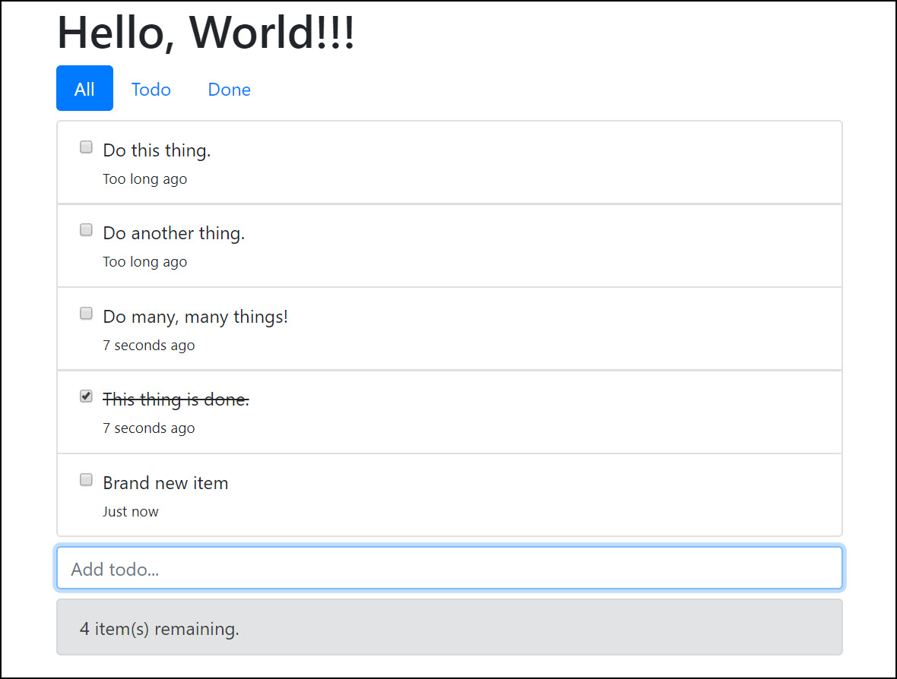

# Filters

### Friendly date format

You might have noticed that there is an unused **created** property in our todo items. This is the date/time the todo item was created. Update as follow below to display the created date/time:



```markup
...
<label class="form-check-label" :for="'todo' + index" :class="{ done: todo.done }">
    {{ todo.title }}
    <br/>
    <small>{{todo.created}}</small>
</label>
...
```



If you save your changes and refresh the browser, you will see the same results below. Not great. We need to fix the formatting and to do that we will use a filter.


In the **main.js** file we're going to create a new filter as below to simply format that ugly date into something more friendly.



```javascript
Vue.filter("friendly-date", date => {
  var diff = new Date() - date;
  if (diff < 1000) return "Just now";
  if (diff < 60000) return `${Math.floor(diff / 1000)} seconds ago`;
  if (diff < 60000 * 60) return `${Math.floor(diff / 60000)} minutes ago`;
  return "Too long ago";
});
...
```



To use the filter, we append the pipe "\|" symbol and the filter name as displayed below: 



```markup
...
<small>{{todo.created | friendly-date}}</small>
...
```



Save your changes and refresh the browser to see the new behaviour:



And when you add a new item, you will see the date changing per item:



