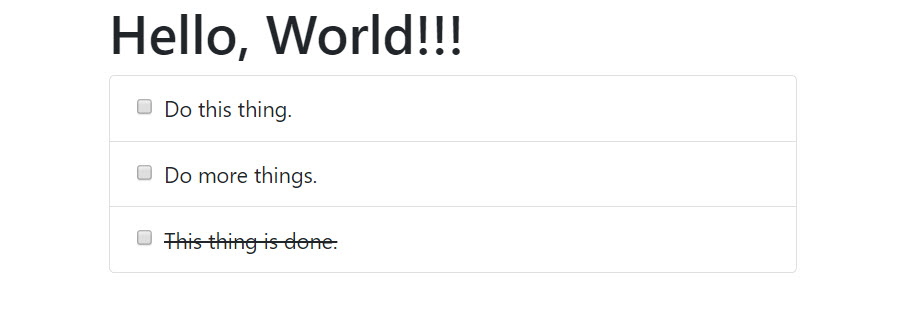

# Your First App

### Getting started

Create a new file named **main.js** and move the contents of the script block into the new file:



```javascript
var app = new Vue({
  el: "#app",
  data: {
    message: "Hello, World!"
  }
});
```



Within **index.html**, remove the script block \(if you haven't already\) and then add a reference to the newly created **main.js** file:



```markup
...
<script src="main.js"></script>
...
```



The above reference should appear just before the closing `body` tag. 

Next, inside the `head` element, add a reference to Bootstrap from the CDN. This is step is not mandatory but it will make the UI look way better just out of the box.



```markup
...
<link rel="stylesheet" href="https://stackpath.bootstrapcdn.com/bootstrap/4.2.1/css/bootstrap.min.css" integrity="sha384-GJzZqFGwb1QTTN6wy59ffF1BuGJpLSa9DkKMp0DgiMDm4iYMj70gZWKYbI706tWS" crossorigin="anonymous">
...
```



Inside the container, we're going to new list as below with some static content:



```markup
...
<ul class="list-group mb-2">
    <li class="list-group-item">
        <div class="form-check">
            <input class="form-check-input" type="checkbox" id="todo1" />
            <label class="form-check-label" for="todo1">Do this thing.</label>
        </div>
    </li>
    <li class="list-group-item">
        <div class="form-check">
            <input class="form-check-input" type="checkbox" id="todo2" /> 
            <label class="form-check-label" for="todo2">Do more things.</label>
        </div>
    </li>
    <li class="list-group-item">
        <div class="form-check">
            <input class="form-check-input" type="checkbox" id="todo3" />
            <label class="form-check-label done" for="todo3">This thing is done.</label>
        </div>
    </li>
</ul>
...
```



Create a new file named **main.css** and add the following style. This will be used to add the strike through for done tasks.



```css
.done {
    text-decoration: line-through;
}
```



Save all changes and view **index.html** in your browser. Your app should display the following:



### Store and display todo items

Store the todo items data in the root Vue instances local state. The local state is stored within the data property. Add the new todos array into the data property in the **main.js** as follows:



```javascript
...
todos: [
    { id: 1, title: "Do this thing.", done: false, created: new Date(2019,1,1) },
    { id: 2, title: "Do another thing.", done: false, created: new Date(2019,3,1) },
    { id: 3, title: "Do many, many things!", done: false, created: new Date() },
    { id: 4, title: "This thing is done.", done: true, created: new Date() }
],
...
```



Update the template. First remove the existing static todo items \(`<li>`\) then add a dynamic list item to display the todo items:



```markup
...
<li class="list-group-item" v-for="(todo, index) in todos" :key="todo.id">
  <div class="form-check">
    <input class="form-check-input" type="checkbox" :id="'todo' + index" v-model="todo.done" />
    <label class="form-check-label" :for="'todo' + index" :class="{ done: todo.done }">{{ todo.title }}</label>
  </div>
</li>
...
```



Save all changes and verify that the todo items display correctly.

### Create new todo items

Next, you will add support for creating todo items. First add two new properties to local state \(within the data property\):



```javascript
...
nextId: 5,
newTodoTitle: null
...
```



Then, to support adding new todo items, create an `addTodo` method within the root instance:



```javascript
...
methods: {
  addTodo() {
    this.todos.push({
      id: this.nextId++,
      title: this.newTodoTitle,
      done: false,
      created: new Date()      
    });
    
    this.newTodoTitle = ''
  }
}
...
```



Finally, update the template to include the form to invoke the new `addTodo` method:



```markup
...
<form class="mb-2" v-on:submit.prevent="addTodo">
  <input class="form-control" placeholder="Add todo..." v-model="newTodoTitle" />
</form>
...
```



Save all changes and verify that you can now add new todo items.

### Filter todo items

Next you will add support for filtering todo items. The supported filters are **All**, **Todo**, and **Done**. Add the list of valid filters and active filter to local state \(within the data property\) as follows:



```javascript
...
filters: ["All", "Todo", "Done"],
activeFilter: 'All',
...
```



In order to filter the todo items based on the active filter you will use a computed property. Update **main.js** to include a new `filteredTodos` computed property. Keep in mind that the computed section is in the same level as the methods and data, not inside of them.



```javascript
...
computed: {
  filteredTodos() {
    if (this.activeFilter === "All") {
      return this.todos;
    }

    if (this.activeFilter === "Todo") {
      return this.todos.filter(t => !t.done);
    }

    if (this.activeFilter === "Done") {
      return this.todos.filter(t => t.done);
    }
  }
}
...
```



Next, include the filters on top of the list \(`<ul>`\). Update **index.html** as follows:



```markup
...
<nav class="nav nav-pills mb-2">
  <a class="nav-link" href="#" 
      v-for="filter in filters" 
      :key="filter" 
      :class="{ active: filter === activeFilter }" 
      @click="activeFilter = filter">
  {{ filter }}
  </a>
</nav>
...
```



Finally, update the template to use the `filteredTodos` computed property rather than access the todo items directly:



```markup
...
<li class="list-group-item" v-for="(todo, index) in filteredTodos" :key="todo.id">
...
```



Save all changes and verify that the todo items are filtered correctly.

### Display number of remaining todo items

The last step is to update the template to display the correct number of remaining items. You can add it after the form tag. 



```markup
...
<div class="alert alert-danger" v-if="todos.filter(t => !t.done).length>10">
You've got a long day ahead of you!!!
</div>
<div class="alert alert-secondary" v-else-if="todos.filter(t => !t.done).length>0">
{{ todos.filter(t => !t.done).length }} item(s) remaining.
</div>
<div class="alert alert-success" v-else>
Hooray!!! You're all done, go to the beach!!!
</div>
...
```



Save the change and verify that number of remaining todo items is correct, and updates when items are added or marked as done.


