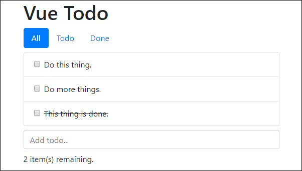

# Your First App

In this section you will build your first app. I know what you're thinking, but Hello, World doesn't count - even if it wasn't particularly glorious! Besides, it's the starter for this application. Let's begin now.

1.  Create a new file named **main.js** and move the contents of the script block into that file:

   
   
   ```javascript
   var app = new Vue({
     el: "#app",
     data: {
       message: "Hello, World!"
     }
   });
   ```
   
   

2. Within **index.html**, remove the script block \(if you haven't already\)
3. Next, add a reference to Bootstrap from the CDN:

   
   
   ```markup
   <link rel="stylesheet" href="https://stackpath.bootstrapcdn.com/bootstrap/4.2.1/css/bootstrap.min.css" integrity="sha384-GJzZqFGwb1QTTN6wy59ffF1BuGJpLSa9DkKMp0DgiMDm4iYMj70gZWKYbI706tWS" crossorigin="anonymous">
   ```
   
   

4. Replace the root element with the following element:

   
   
   ```markup
   <div id="app" class="container">
       <h1>Vue Todo</h1>

       <nav class="nav nav-pills mb-2">
       <a class="nav-link active" href="#">All</a> <a class="nav-link" href="#">Todo</a> <a class="nav-link" href="#">Done</a>
       </nav>

       <ul class="list-group mb-2">
       <li class="list-group-item">
           <div class="form-check">
               <input class="form-check-input" type="checkbox" id="todo1" />
               <label class="form-check-label" for="todo1">Do this thing.</label>
           </div>
       </li>
       <li class="list-group-item">
           <div class="form-check">
               <input class="form-check-input" type="checkbox" id="todo2" /> 
               <label class="form-check-label" for="todo2">Do more things.</label>
           </div>
       </li>
       <li class="list-group-item">
           <div class="form-check">
               <input class="form-check-input" type="checkbox" id="todo3" />
               <label class="form-check-label done" for="todo3">This thing is done.</label>
           </div>
       </li>
       </ul>

       <form class="mb-2"><input class="form-control" placeholder="Add todo..." /></form>

       <p>2 item(s) remaining.</p>
   </div>
   ```
   
   

5. Add a new style sheet file **main.css** and complete as follows:

   
   
   ```css
   .done {
       text-decoration: line-through;
   }
   ```
   
   

6. Save all changes and view **index.html** in your browser. Your app should display the following:



1. Update the root Vue instance with the todo list data:

   
   
   ```javascript
     data: {
       todos: [
         { id: 1, title: "Do this thing.", done: false },
         { id: 2, title: "Do another thing.", done: false },
         { id: 3, title: "Do many, many things!", done: false },
         { id: 4, title: "This thing is done.", done: true }
       ]
     }
   ```
   
   

2. Update the template. First remove the existing todo list items, then add a dynamic list item to display the todos from data:

   
   
   ```markup
   <li class="list-group-item" v-for="(todo, index) in todos" :key="todo.id">
     <div class="form-check">
       <input class="form-check-input" type="checkbox" :id="'todo' + index" v-model="todo.done" />
       <label class="form-check-label" :for="'todo' + index" :class="{ done: todo.done }">{{ todo.title }}</label>
     </div>
   </li>
   ```
   
   

3. Save changes and verify expected behaviour.
4. Next, update to support adding new todos. First add two new data properties:

   
   
   ```javascript
   nextId: 5,
   newTodoTitle: null
   ```
   
   

5. Then, create a method for adding todos:

   
   
   ```javascript
   methods: {
     addTodo() {
       this.todos.push({
         id: this.nextId++,
         title: this.newTodoTitle,
         done: false
       });
     }
   }
   ```
   
   

6. Finally, update to submit to the new `addTodo` method:

   
   
   ```markup
   <form class="mb-2" v-on:submit.prevent="addTodo">
     <input class="form-control" placeholder="Add todo..." v-model="newTodoTitle" />
   </form>
   ```
   
   

7. Save all changes and verify that you can now add new todos.
8. Now add support for filtering the todo list. The supported filters are All, Todo, and Done. Add them to data as follows:

   
   
   ```javascript
   filters: ["All", "Todo", "Done"],
   activeFilter: 'All',
   ```
   
   

9. Next update **main.js** and add a new computed property to filter the todos:

   
   
   ```javascript
   computed: {
     filteredTodos() {
       if (this.activeFilter === "All") {
         return this.todos;
       }

       if (this.activeFilter === "Todo") {
         return this.todos.filter(t => !t.done);
       }

       if (this.activeFilter === "Done") {
         return this.todos.filter(t => t.done);
       }
     }
   }
   ```
   
   

10. Next, update the template to use the filters within data:

    
    
    ```markup
    <a class="nav-link" href="#" 
        v-for="filter in filters" 
        :key="filter" 
        :class="{ active: filter === activeFilter }" 
        @click="activeFilter = filter">
      {{ filter }}
    </a>
    ```
    
    

11. Then update the template to use the `filteredTodos` computed property:

    
    
    ```markup
    <li class="list-group-item" v-for="(todo, index) in filteredTodos" :key="todo.id">
    ```
    
    

12. Finally, update the template to display the correct number of remaining items:

    
    
    ```markup
    <p>{{ todos.filter(t => !t.done).length }} item(s) remaining.</p>
    ```
    
    

13. Save changes and verify that the behaviour is as expected.

