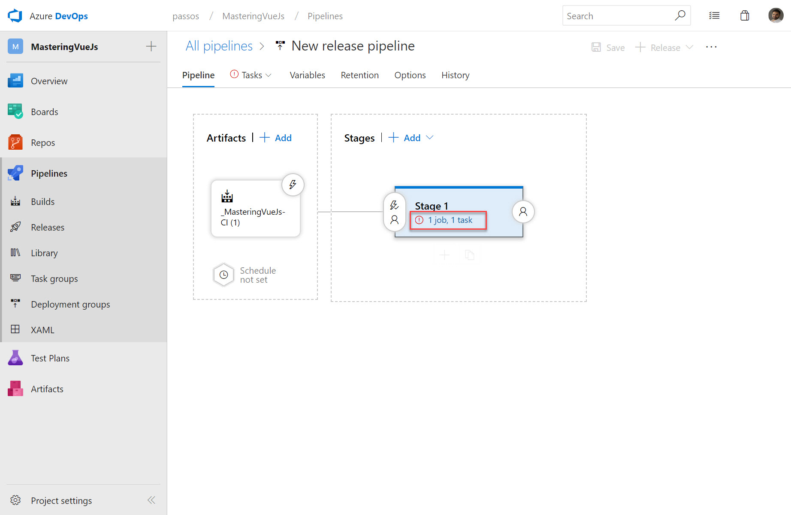

# Continuous Deployment

It's time to create our release pipeline, but before that we should create a new web app in Azure.

Back to Azure DevOps.

If everything went as planned, you should see the screen below

And finally, we will have our application running in azure.

