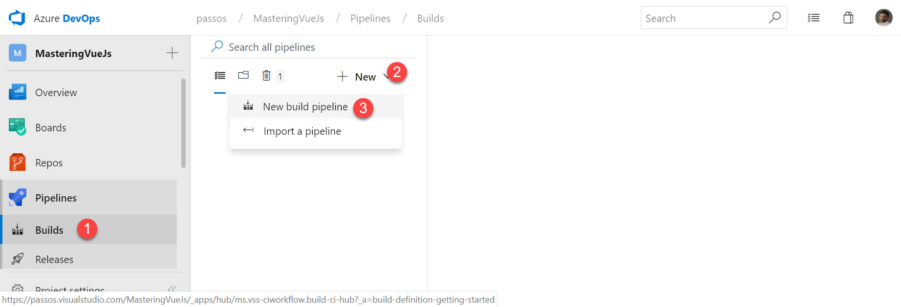
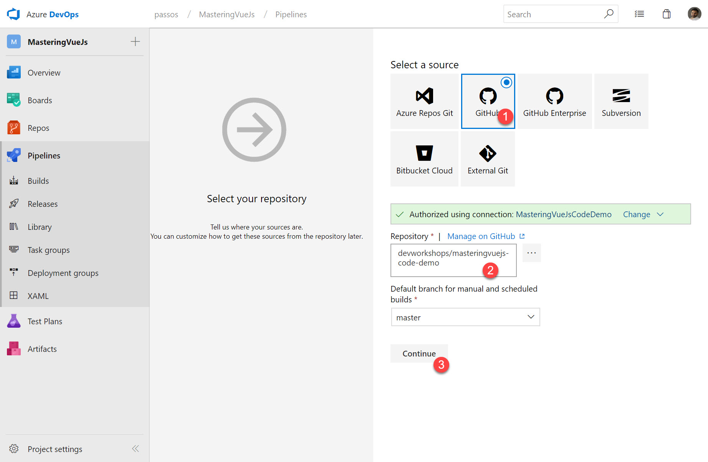
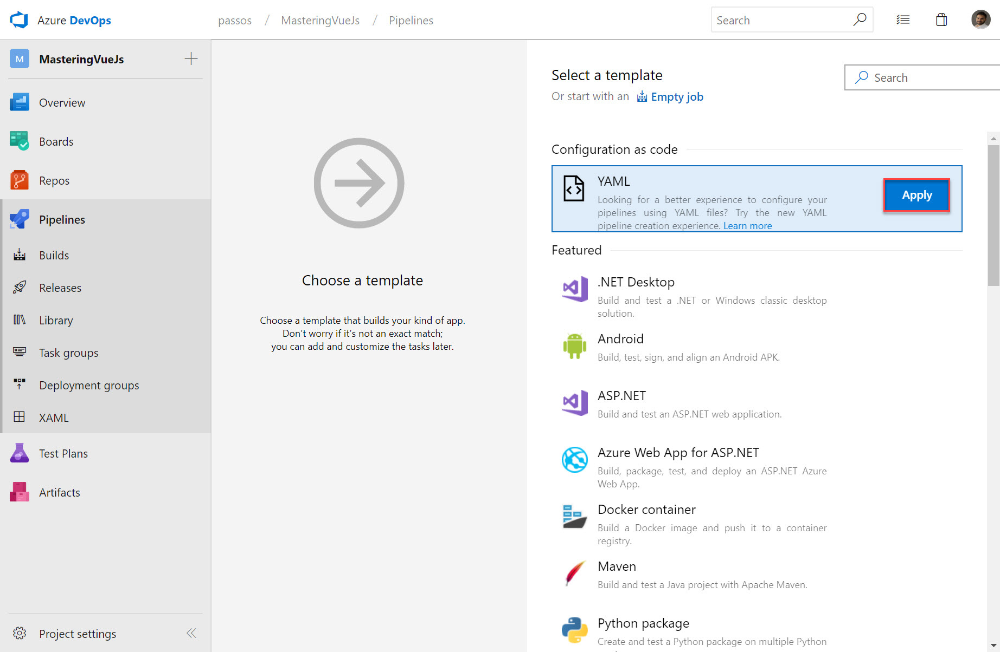
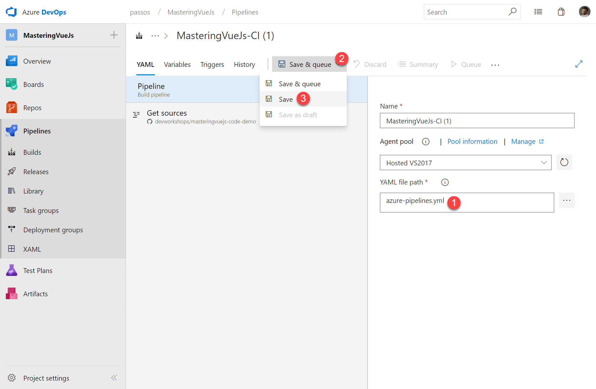
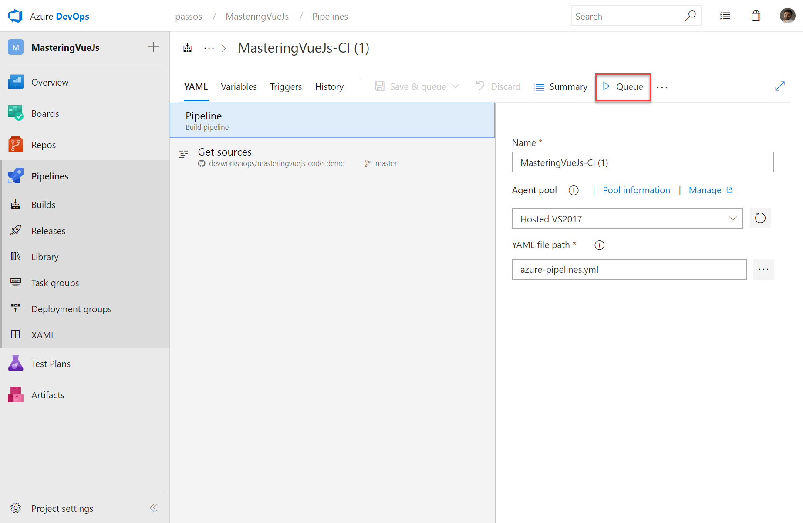
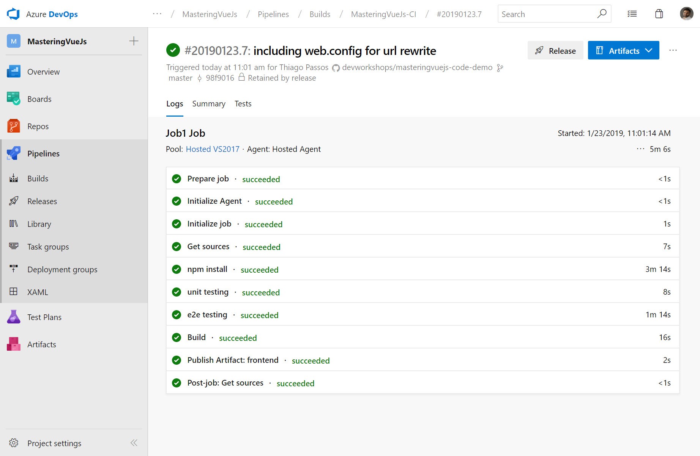

# Continuous Integration

In the presentation, we've mentioned a lot CI and CD tools available, but for this demo we're going to use [Azure DevOps](https://azure.microsoft.com/en-au/services/devops/) formally known as **VSTS** or **Visual Studio Online**. It's an awesome tool not only for your CI and CD pipelines, but to keep track of your work, host your repositories and more.

They have a great UI for you to create your pipelines, but we're going use YAML because it's super simple to make change to it and to share with other people instead of relying on specific people with enough privileges to make changes.

To start with, we're going to create an **azure-pipelines.yml** file in the root of your repository and we're going to paste this script to it. 



```yaml
queue:
  name: Hosted VS2017
  demands: npm

trigger:
  - master

steps:
  - task: Npm@1
    displayName: "npm install"
    inputs:
      verbose: false

  - task: Npm@1
    displayName: "unit testing"
    inputs:
      command: custom
      verbose: false
      customCommand: "run test:unit"

  - task: Npm@1
    displayName: "e2e testing"
    inputs:
      command: custom
      verbose: false
      customCommand: "run test:e2e:ci"

  - task: Npm@1
    displayName: "build"
    inputs:
      command: custom
      verbose: false
      customCommand: "run build"

  - task: PublishBuildArtifacts@1
    displayName: "Publish Artifact: frontend"
    inputs:
      PathtoPublish: "dist"
      ArtifactName: frontend

```



Don't worry too much about the syntax of this file, it's not as complicated as it looks, basically what we want to do is running these tasks

* npm install
* npm run test:unit
* npm run test:e2e
* npm run build

And finally copy the outcome \(the dist folder\) to an artifact that can be used to deploy. If you want to know more about the YAML, check [this documentation](https://docs.microsoft.com/en-us/azure/devops/pipelines/yaml-schema?view=vsts&tabs=schema#task) and if you want to know what other tasks are available on Azure DevOps, check [here](https://docs.microsoft.com/en-us/azure/devops/pipelines/tasks/index?view=vsts).

Time to go to the [Azure DevOps](https://azure.microsoft.com/en-au/services/devops/), if you don't have an account, we highly encourage you do it.











If everything went well, you should see a screen similar to the below



