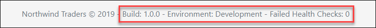

# Accessing State

Now that Vuex is up and running we can get started. The steps in this section describe the procedure to access state from a component. In this example you will add release information \(such as build number and environment name\) to the store. You will then display the release information within the site footer.

Let's begin now.

1. In Visual Studio Code, open **store.js** and update the store as follows:

   
   
   ```javascript
   state: {
        release: {
            build: '1.0.0',
            environment: 'Development'
        },
        healthChecks: [
            { title: 'SMTP check', passed: true },
            { title: 'Database check', passed: true }
        ]
   }
   ```
   
   

2. Next open **App.vue** and update the footer as follows:

   
   
   ```markup
    <footer class="footer mt-auto py-3">
        <div class="container">
            <span class="text-muted">
                Northwind Traders &copy; {{new Date()|date('YYYY')}}
                - Build: {{ $store.state.release.build }}
                - Environment: {{ $store.state.release.environment }}
                - Failed Health Checks: {{ $store.state.healthChecks.filter(hc => !hc.passed).length }}
            </span>
        </div>
    </footer>
   ```
   
   

3. Review the changes in your browser. The footer should now contain the release and health check details: 

The `$store` is injected into all child components from the root component. This is enabled by configuring the store option within the root instance:

```markup
const app = new Vue({
    el: '#app',
    store
})
```

1. Using a computed property enables a reusable and concise approach. Update the following computed properties to the component:

   
   
   ```javascript
   computed: {
       release() {
           return this.$store.state.release
       },
       failedHealthCheckCount() {
           return this.$store.state.healthChecks.filter(hc => !hc.passed).length
       }
   }
   ```
   
   

2. Next update the footer with these changes:

   
   
   ```markup
    <footer class="footer mt-auto py-3">
        <div class="container">
            <span class="text-muted">
                Northwind Traders &copy; {{new Date()|date('YYYY')}}
                - Build: {{ release.build }}
                - Environment: {{ release.environment }}
                - Failed Health Checks: {{ failedHealthCheckCount }}
            </span>
        </div>
    </footer>
   ```
   
   

When a component needs to make use of numerous state, declaring many computed properties is rather verbose. Fortunately we can levarage the `mapState` helper to avoid doing so.

> The `mapState` helper simply generates computed getter functions saving keystrokes.

1. First import the `mapState` helper from Vuex:

   
   
   ```javascript
   import { mapState } from 'vuex'
   ```
   
   

2. Update the components computed properties as follows:

   
   
   ```javascript
   computed: {
       ...mapState(['release', 'healthChecks']),
       failedHealthCheckCount() {
           return this.healthChecks.filter(hc => !hc.passed).length
       }
   }
   ```
   
   

In the case of the `failedHealthCheckCount` computed property, this approach works well within the context of this component. However, what if the same derived state was required in other components? You can achieve this flexibility by moving the computed property to the store. Using Getters,

1. Open **store.js** and add a new **getters** property:

   
   
   ```javascript
   getters: {
       failedHealthCheckCount: state => {
           return state.healthChecks.filter(hc => !hc.passed).length
       }
   }
   ```
   
   

2. Back within **App.vue**, update `failedHealthCheckCount` to reference the new getter:

   
   
   ```javascript
    failedHealthCheckCount() {
        return this.$store.getters.failedHealthCheckCount
    }
   ```
   
   

When a component needs to make use of numerous getters, we can leverage the `mapGetters` helper to for a simplified approach.

> The `mapGetters` helper simply maps store getters to local computed properties.

1. Import the `mapGetters` helper from Vuex:

   
   
   ```javascript
   import { mapState, mapGetters } from 'vuex'
   ```
   
   

2. Update the components computed properties as follows:

   
   
   ```javascript
   computed: {
       ...mapState(['release', 'healthChecks']),
       ...mapGetters(['failedHealthCheckCount'])
   }
   ```
   
   

3. Save all changes and verify that the footer is still displaying the correct information.

