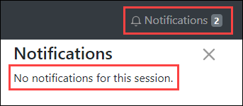

# Changing State

This feature will allow notifications, such as success and error messages, to be raised from anywhere within the application. This feature will leverage the Vuex store in order to provide a centralised location to keep, raise, and dismiss notifications.

In Visual Studio Code, create a new **NotificationPanel.vue** file within the **components** folder.

Implement the new component as follows:



```markup
<template>
    <div>
        <div class="clearfix">
            <h4 class="float-left pt-1">Notifications</h4>
            <b-button variant="link" v-b-toggle.collapseNotifications class="float-right">
                &times;
            </b-button>
        </div>

        <p v-if="notifications.length === 0">No notifications for this session.</p>

        <b-alert show dismissible
            v-for="notification in notifications"
            :key="notification.id"
            :variant="notification.context"
            @dismissed="dismissNotification(notification.id)">
            <strong>{{ notification.context === 'success' ? 'Success' : 'Error' }}</strong>
            <br>
            {{ notification.message }}
        </b-alert>
    </div>
</template>

<script>
export default {
    data() {
        return {
            notifications: [
                {
                    id: 1,
                    context: 'success',
                    message: 'A new product has been created.'
                },
                {
                    id: 2,
                    context: 'danger',
                    message: 'A product has failed to update.'
                }
            ]
        }
    },
    methods: {
        dismissNotification(id) {
            this.notifications = this.notifications.filter(n => n.id !== id)
        }
    }
}
</script>

<style scoped>
.feather {
    height: 28px;
    width: 28px;
    color: #999;
}
</style>
```



Take a moment to review the new component, and ensure you are familiar with the concepts used within.

Open **App.vue** and import the new `NotificationPanel` component:



```javascript
...
import NotificationPanel from '@/components/NotificationPanel.vue'

...

export default {
    name: 'app',
    components: {
        NotificationPanel
    },
...
```



Update the template within **App.vue** as follows:



```markup
...
<b-container>
    <b-row>
        <b-col>
            <main role="main" class="flex-shrink-0">
                <div class="container">
                    <router-view/>
                </div>
            </main>
        </b-col>
        <b-collapse id="collapseNotifications" class="border-left pl-2">
            <b-col>
                <notification-panel></notification-panel>
            </b-col>
        </b-collapse>
    </b-row>
</b-container>
...
```



In the above code, the container contains two columns. The first for the main content and the second for the notification panel.

Add the following style to control the size of the notifications panel:



```css
...
#collapseNotifications {
    width: 30%;
}
...
```



Open **NavBar.vue** and update the template as follows:



```markup
...
<b-collapse is-nav id="navbarCollapse">
    <b-navbar-nav class="mr-auto" v-if="isLoggedIn">
        <b-nav-item to="/" :exact="true">
            <vue-feather type="home"></vue-feather>Home
        </b-nav-item>
        <b-nav-item to="/suppliers">
            <vue-feather type="shopping-cart"></vue-feather>Suppliers
        </b-nav-item>
        <b-nav-item to="/categories">
            <vue-feather type="list"></vue-feather>Categories
        </b-nav-item>
        <b-nav-item to="/products">
            <vue-feather type="package"></vue-feather>Products
        </b-nav-item>
    </b-navbar-nav>
    <b-navbar-nav>
        <b-nav-item to="/login" v-if="!isLoggedIn">
            <vue-feather type="log-in"></vue-feather>Login
        </b-nav-item>
        <b-nav-item @click="logout()" v-if="isLoggedIn">
            <vue-feather type="log-out"></vue-feather>Logout
        </b-nav-item>
        <b-nav-item
            v-if="isLoggedIn"
            v-b-toggle.collapseNotifications>
            <vue-feather type="bell"></vue-feather>Notifications
            <b-badge>2</b-badge>
        </b-nav-item>
    </b-navbar-nav>
</b-collapse>
...
```



The first navbar list contains the standard nav items. The second list contains the notifications icon. Clicking this icon will toggle the notifications panel on and off.


Take a moment to explore the feature to ensure that you understand the basic functionality.

Currently, the notifications are stored within the `NotificationPanel` component:



```javascript
...
data() {
    return {
        notifications: [
            {
                id: 1,
                context: 'success',
                message: 'A new product has been created.'
            },
            {
                id: 2,
                context: 'danger',
                message: 'A product has failed to update.'
            }
        ]
    }
},
...
```



Since these notifications will only be accessible to this component, you will need to move them into the store.

Open **store.js** for editing and add the sample notifications into state:



```text
...
state: {
    release: {
        build: '1.0.0',
        environment: 'Development'
    },
    healthChecks: [
        { title: 'SMTP check', passed: true },
        { title: 'Database check', passed: true }
    ],
    notifications: [
        {
            id: 1,
            context: 'success',
            message: 'A new product has been created.'
        },
        {
            id: 2,
            context: 'danger',
            message: 'A product has failed to update.'
        }
    ]
}
...
```



Back within **NotificationPanel.vue**, delete the `data` property altogether as the component will no longer have local state.

In order to reference the notifications within the store you can use `mapState`. First import `mapState` from Vuex:



```javascript
...
import { mapState } from 'vuex'
...
```



Then add a new computed property as follows:



```javascript
...
computed: mapState(['notifications']),
...
```



Save changes and verify that the feature is working correctly.

There is a error when attempting to dismiss a notification. Try, and you will see the following error in the developer console:


This is because the dismiss notification feature attempts to change state within the Vuex store. In order to change the list of notifications you will need to add a **mutation** to the store.

> Mutations are used to commit and track changes to state.

Open **store.js** and add a new mutation to dismiss a notification:



```javascript
...
mutations: {
    dismissNotification(state, payload) {
        state.notifications = state.notifications.filter(n => n.id !== payload)
    }
}
...
```



Back within **NotificationPanel.vue** update the `dismissNotification` method to use the new mutation:



```javascript
...
dismissNotification(id) {
    this.$store.commit('dismissNotification', id)
}
...
```



Save all changes and verify that you can now dismiss notifications without error.

The is another error. The number of notifications within the navbar is not updating correctly: 

To fix this error simply add a new getter to return the number of notifications. Open **store.js** and update as follows:



```javascript
...
notificationCount: state => {
    return state.notifications.length;
}
...
```



Next, open **NavBar.vue** and use the new getter to return the correct notification count:



```markup
...
<b-nav-item v-b-toggle.collapseNotifications>
    <vue-feather type="bell"></vue-feather>Notifications
    <b-badge>
        {{ $store.getters.notificationCount }}
    </b-badge>
</b-nav-item>
...
```



Much better! While playing with sample notification is good fun, it's time for the real thing.

First, remove the sample notifications from **store.js:**



```javascript
...
state: {
    release: {
        build: '1.0.0',
        environment: 'Development'
    },
    healthChecks: [
        { title: 'SMTP check', passed: true },
        { title: 'Database check', passed: true }
    ],
    notifications: []
},
...
```



Next add a mutation to the store to raise notifications. Open **store.js** and add a new mutation named `raiseNotification`:



```javascript
...
raiseNotification(state, payload) {
    state.notifications.push({
        id: nextNotificationId++,
        context: payload.context,
        message: payload.message
    })
}
...
```



The above mutation requires a local variable named `nextNotificationId` that will provide a unique identifier to new notifications. Add the variable just before Vuex store is defined:

```text
let nextNotificationId = 0
```

With this mutation in place you could start raising new notifications from any component within the application. However, best practice states that you should call mutations from within a Vuex action.

> Actions are similar to mutations. However, instead of mutating state, actions commit mutations. Actions can contain business logic and arbitrary asynchronous operations.

Update the store with two new actions. One for raising success notifications and another for raising error notifications:



```javascript
...
actions: {
    raiseSuccessNotification({ commit }, payload) {
        commit('raiseNotification', {
            context: 'success',
            message: payload
        })
    },
    raiseErrorNotification({ commit }, payload) {
        commit('raiseNotification', {
            context: 'danger',
            message: payload
        })
    }
}
...
```



Now you are ready to start raising notifications. First, you need to map the new actions so that they are available to the component. Open **CategoryList.vue** and update as follows:



```javascript
...
import { mapActions } from 'vuex'
...
```



Then within methods:



```javascript
...
...mapActions(['raiseSuccessNotification', 'raiseErrorNotification'])
...
```



Next, raise an error notification if the categories list fails to load:



```javascript
...
CategoriesService.getAll()
    .then(result => (this.categories = result.data))
    .catch(() => {
        this.raiseErrorNotification('A server error occurred attempting to get all categories.')
    })
...
```



When a category is deleted return a success notification, or an error notification if the category fails to delete:



```javascript
...
CategoriesService.delete(id)
    .then(() => {
        this.categories = this.categories.filter(c => c.id !== id)
        this.raiseSuccessNotification(`The category was successfully deleted.`)
    })
    .catch(() => {
        this.raiseErrorNotification(`A server error occurred attempting to delete the category.`)    
    })
...
```



Add success and error notifications when creating a new category:



```javascript
...
CategoriesService.create(this.addingCategory)
    .then(() => {
        this.raiseSuccessNotification(`The category '${this.addingCategory.name}' was successfully created.`)
        this.fetchAll()
        this.resetAdd()
    })
    .catch(() => {
        this.raiseErrorNotification(`A server error occurred attempting to create the category '${this.addingCategory.name}'.`)
    })
...
```



And finally, add notifications when updating an existing category:



```javascript
...
CategoriesService.update(this.editingCategory)
    .then(() => {
        this.raiseSuccessNotification(`The category '${this.editingCategory.name}' was successfully updated.`)
        this.categories[this.editingIndex] = this.editingCategory
        this.editingCategory = {}
    })
    .catch(() => {
        this.raiseErrorNotification(`A server error occurred attempting to update the category '${this.editingCategory.name}'.`)
    })
...
```



Save all changes and verify correct behaviour. Stopping the json-server is an easy way to cause API errors so that you can test the error notifications.

