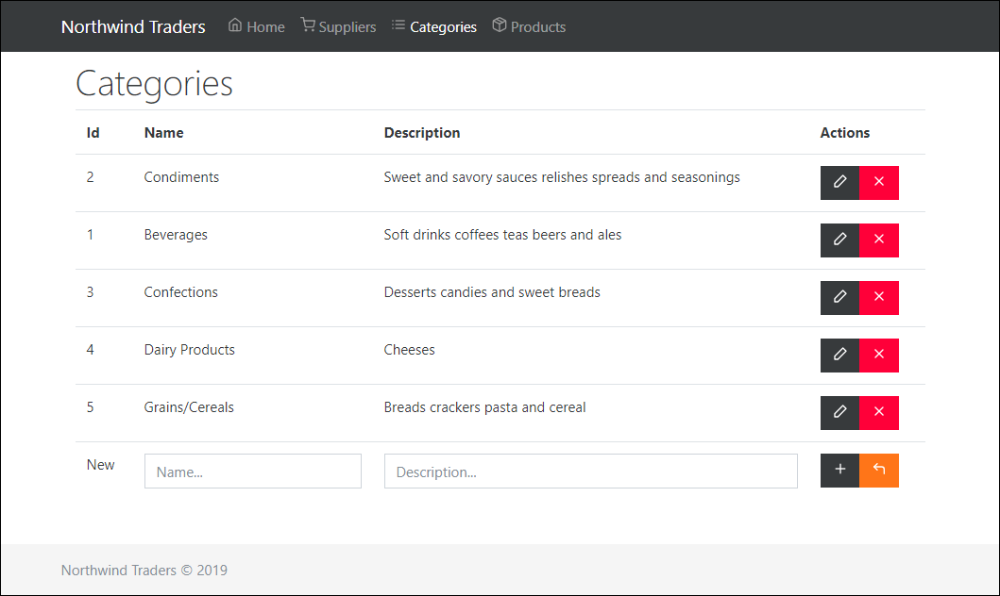

# Themes

## Working with Sass

Vue CLI projects come with support for pre-processors including Sass, Less, and Stylus. Since a CSS pre-processor was not selected when creating this project, you will need to manually install the corresponding webpack loaders:

```text
npm install sass-loader node-sass --save-dev
```

No further configuration is required, as the internal webpack config is pre-configured to handle all pre-processors.

You can now import Sass file types, or use Sass in .vue components as follows:

```markup
<style lang="scss">
$color: red;
</style>
```

One last step is to switch from importing bootstrap.css to bootstrap.scss. First, remove the following imports from **main.js** as follows:



```javascript
...
import 'bootstrap/scss/bootstrap.css'
import 'bootstrap-vue/dist/bootstrap-vue.css'
...
```



Then, add a new style block to **App.vue** as follows:



```markup
...
<style lang="scss">
@import '~bootstrap/scss/bootstrap';
@import '~bootstrap-vue/dist/bootstrap-vue';
</style>
...
```



Save all changes and ensure the site loads appears normally. In the following topics, you will optionally choose a new theme and customise the sites appearance.

## Choosing a new theme \(optional\)

When building prototypes or line of business applications often choosing a new theme is a good way to get started. Fortunately, there are a number of free themes available at [bootswatch.com](https://bootswatch.com/). In this section you will choose a new theme to apply to your application. Start by installing bootswatch:

```text
npm install bootswatch --save
```

Next, the .scss imports with your chosen theme. For example, if you have chosen Cosmo, update **App.vue** as follows:



```markup
...
<style lang="scss">
@import '~bootswatch/dist/Cosmo/variables';
@import '~bootstrap/scss/bootstrap';
@import '~bootswatch/dist/Cosmo/bootswatch';
@import '~bootstrap-vue/dist/bootstrap-vue';
</style>
...
```



Save all changes and ensure that the site is using the chosen theme:



## Customising the theme

In order to customise the theme of the application, you will create a new .scss file that contains the required customisations. Within the **assets** folder, create a new file named **custom.scss**. Then update **App.vue** to reference the new file:



```markup
...
<style lang="scss">
@import './assets/custom.scss';
@import '~bootswatch/dist/Cosmo/variables';
@import '~bootstrap/scss/bootstrap';
@import '~bootswatch/dist/Cosmo/bootswatch';
@import '~bootstrap-vue/dist/bootstrap-vue';
</style>
...
```



You can now customise the appearance of the site by updating the **custom.scss** file. For example, an update to the primary colour would be added as follows:



```css
$primary: #c0ff33;
```



A good way to get started is to review the \_variables.scss file from your chosen theme. It contains just over one-hundred lines of SCSS that would allow you to customise the entire appearance of your site.

