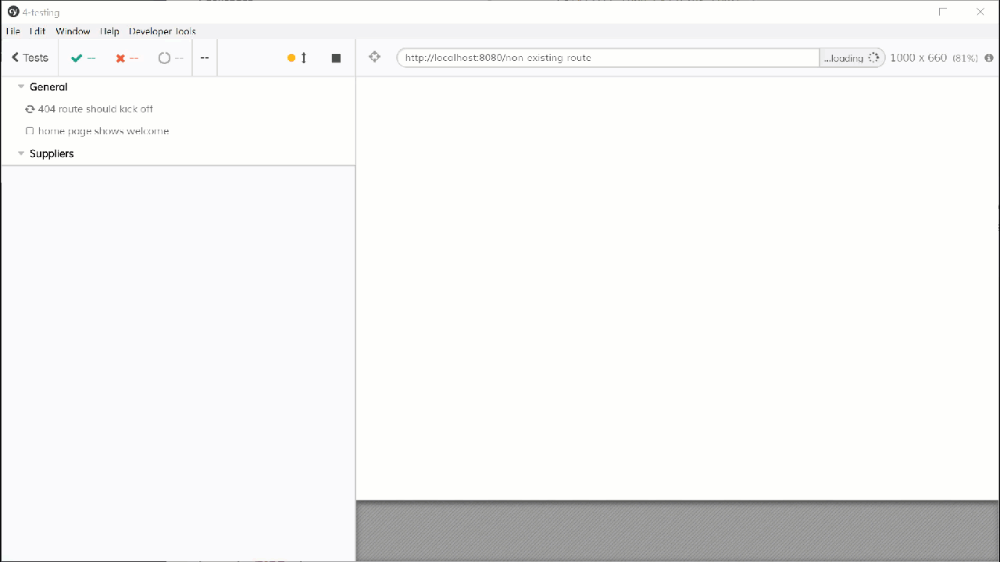

# Integration/E2E Testing

If you were brave enough to run `npm run test:e2e` in the overview section, that's what you were expecting to see


### Creating test case

We're going to create a few meaningful integration tests here just to see if everything is in place. Be aware that this requires the project's dependencies to be running. If you're using a real API or **json-server**, make sure it's running. 

Let's create a file called **general.js** under **tests/e2e/specs** and to start with we're going to test 2 things, whether the 404 route is working and if the home page contains the text that's supposed to contains.



```javascript
describe('General', () => {
    it('404 route should kick off', () => {
        cy.visit('/non-existing-route')
        cy.contains('h1', 'Oops')
    })

    it('home page shows welcome', () => {
        cy.visit('/')
        cy.contains('h1', 'Welcome')
    })
})

```



Now let's test some CRUD operations under **Suppliers**. This will a bit more complex, we'll test not only UI aspects when navigating to a route, but also whether it's able to connect to the api and successfully update records.



```javascript
describe('Suppliers', () => {
    it('Should open list of suppliers', () => {
        cy.visit('/suppliers')
        cy.contains('h1', 'Suppliers')
        cy.get('table thead th').should('have.length', 5)
    })

    it('Should update existing supplier', () => {
        cy.visit('/suppliers')
        cy.contains('h1', 'Suppliers')
        cy.get('a.suppliers-edit:first').click()
        cy.contains('h1', 'Supplier #')
        cy.get('input#companyNameField').type('NEW COMPANY')
        cy.get('button#saveButton').click()
        cy.contains('table tbody td:first-child', 'NEW COMPANY')
    })

    it('Should create new supplier', () => {
        cy.visit('/suppliers/new')
        cy.get('input#companyNameField').type('NEW COMPANY')
        cy.get('input#contactNameField').type('NEW CONTACT')
        cy.get('input#contactTitleField').type('CONTACT TITLE')
        cy.get('input#contactNameField').type('.')
        cy.get('button#saveButton').click()
        cy.contains('table tbody tr:last-child td:first-child', 'NEW COMPANY')
    })
})

```



Once this is created we can run it using the command `npm run test:e2e2` 



For more information about the integration test API, check their [documentation](https://docs.cypress.io/api/introduction/api.html)

