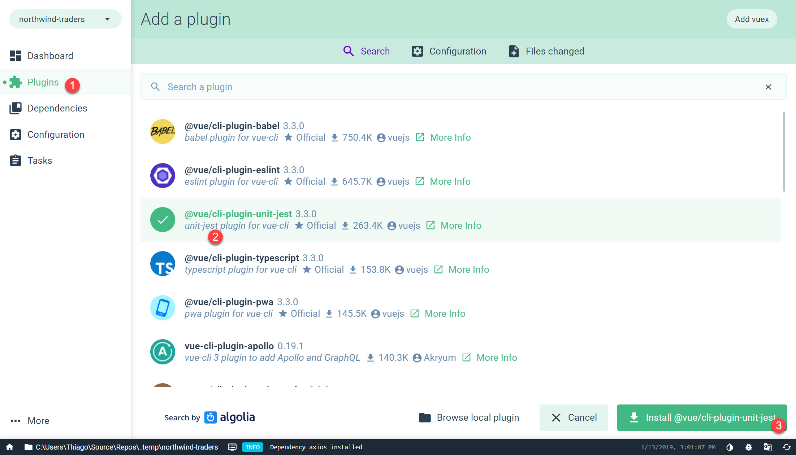
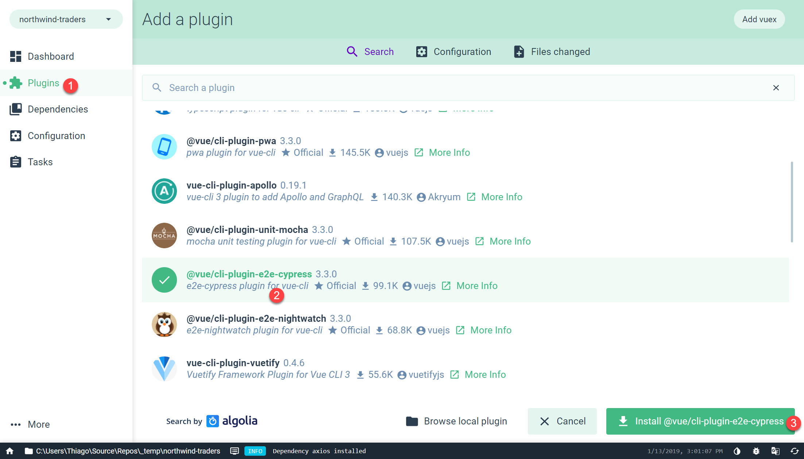
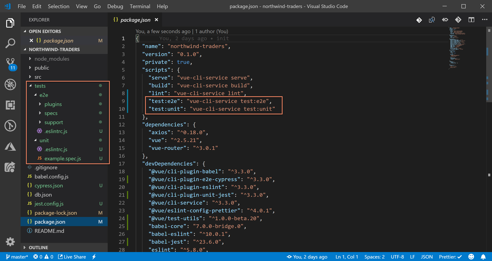

# Overview

We know, as a developer, testing is not always the most exciting part of building a project, but we hope at the end of this section we can change your mind. We'll show you how testing is now cool and the different ways we can approach it.

## Installation

For this section we're going to use [Jest](https://jestjs.io/) for unit testing and [Cypress](https://www.cypress.io/) for end-to-end testing. Again, one way to install them is by using the UI, the other way is by running in the command line `vue add @vue/cli-plugin-unit-jest` and `vue add @vue/cli-plugin-e2e-cypress`

After installing this 2 plugins you'll notice a bunch of changes to your project. A new test folder was created in the root directory with a bunch of yet to learn files. Also 2 new scripts were added to **package.json** and you could even give it a try by running `npm run test:e2e` and `npm run test:unit`

