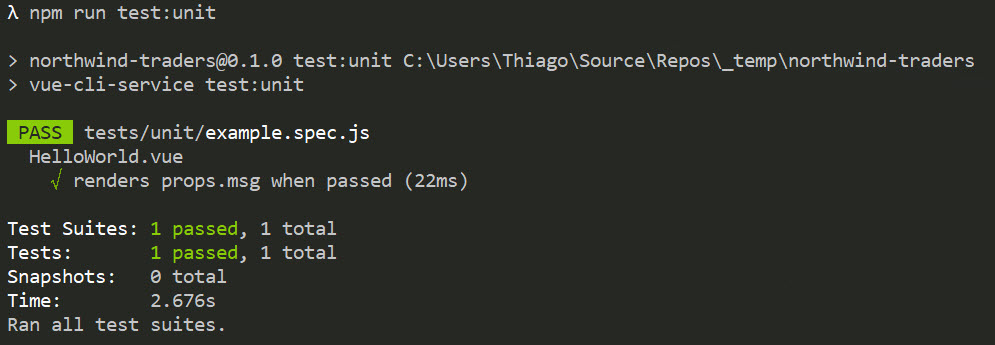
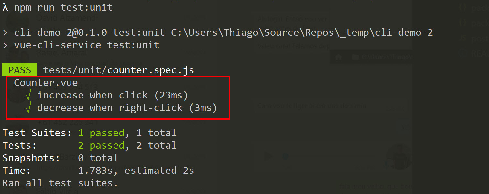

# Unit Testing

If you were brave enough to run `npm run test:unit` in the previous section, that's what you were expecting to see:



### Creating test case

What about practicing a bit of TDD \(test-driven development\)? Let's create a new test spec file called **counter.spec.js** which is going to be the test cases for a component that still doesn't exist.

We basically want to test a counter component which counts the number of times the user clicks on the button, if the user clicks with the right button it should then decrease the value. We also want different CSS classes for when the count is positive and negative.

The spec below will test all those things, but it's not that readable. There's a lot of room for improvement. 



```javascript
import { shallowMount } from '@vue/test-utils'
// this component still doesn't exist, so expect an error here
import Counter from '@/components/Counter.vue'

describe('Counter.vue', () => {
    it('increase when click, decrease when right-click', () => {
        const wrapper = shallowMount(Counter)
        expect(wrapper.vm.counter).toBe(0)
        wrapper.find('button').trigger('click')
        expect(wrapper.vm.counter).toBe(1)
        expect(wrapper.find('button').classes('positive')).toBeTruthy()
        wrapper.find('button').trigger('contextmenu')
        wrapper.find('button').trigger('contextmenu')
        expect(wrapper.vm.counter).toBe(-1)
        expect(wrapper.find('button').classes('negative')).toBeTruthy()
    })
})
```



Let's try to separate at least the left and right clicks. The code now is easier to follow, especially because we're splitting the different features of the component into different test cases. But there's still a lot of repetition.



```javascript
import { shallowMount } from '@vue/test-utils'
import Counter from '@/components/Counter.vue'

describe('Counter.vue', () => {
    it('increase when click', () => {
        const wrapper = shallowMount(Counter)
        expect(wrapper.vm.counter).toBe(0)
        wrapper.find('button').trigger('click')
        expect(wrapper.vm.counter).toBe(1)
        expect(wrapper.find('button').classes('positive')).toBeTruthy()
    })
    it('decrease when right-click', () => {
        const wrapper = shallowMount(Counter)
        expect(wrapper.vm.counter).toBe(0)
        wrapper.find('button').trigger('contextmenu')
        expect(wrapper.vm.counter).toBe(-1)
        expect(wrapper.find('button').classes('negative')).toBeTruthy()
    })
})
```



Why not reusing some of the code for every test case? We're moving the mounting the initial value of the counter to a common place. Now all test cases are very slim.



```javascript
import { shallowMount } from "@vue/test-utils";
import Counter from "@/components/Counter.vue";

describe("Counter.vue", () => {
  let wrapper;

  // this will before every test case
  beforeEach(() => {
    wrapper = shallowMount(Counter);
    expect(wrapper.vm.counter).toBe(0);
  });

  it("increase when click", () => {
    wrapper.find("button").trigger("click");
    expect(wrapper.vm.counter).toBe(1);
    expect(wrapper.find("button").classes("positive")).toBeTruthy();
  });

  it("decrease when right-click", () => {
    wrapper.find("button").trigger("contextmenu");
    expect(wrapper.vm.counter).toBe(-1);
    expect(wrapper.find("button").classes("negative")).toBeTruthy();
  });
});

```



Try running the tests now with `npm run test:unit`, you should get a bunch of errors, but as you implement your components, the errors will go away.

### Implementing component

Let's now create the component to meet all the requirements from the unit test. We're going to create a **Counter.vue** under the components folder.



```markup
<template>
  <div>
    <button
      @click="increase()"
      @contextmenu.prevent="decrease()"
      :class="{'positive':counter>0,'negative':counter<0} "
    >{{counter}}</button>
  </div>
</template>

<script>
export default {
  data() {
    return {
      counter: 0
    };
  },
  methods: {
    increase() {
      this.counter++;
    },
    decrease() {
      this.counter--;
    }
  }
};
</script>

<style scoped>
.positive {
  background-color: blue;
}
.negative {
  background-color: red;
}
</style>
```



Now meeting all the requirements and running the unit tests again, we'll have all greens.



